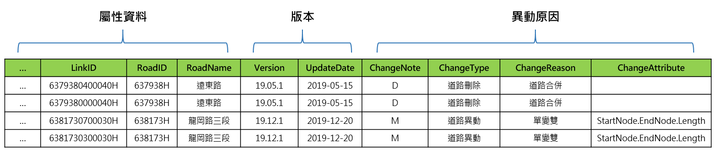
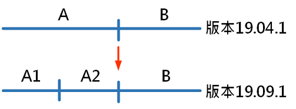

# 圖臺與LinkID導入工具

皆提供最新版資料，並註記目前使用之版本號。

# 異動紀錄

## 異動資料欄位

1\. 屬性資料：敘述道路或運輸場站(或其他對應檔)之基本資料。

2\. 版本：記錄版本控管，相關欄位為Version及UpdateDate。Version於每次圖資異動時全圖更新版號，UpdateDate則於實際資料發生異動時更新，版本紀錄方式說明如下圖。

3\. 異動原因：說明異動類型、異動原因及異動欄位名稱。

## 異動API

1\. 歷史版本查詢

# 下載區

每次路段編碼更新皆會提供異動更新檔(含路段編碼、運輸場站、路況偵測設施等)，歷次更新之異動資料請至本網站資料下載區 (https://link.motc.gov.tw/DownloadFile) 下載。

# 離線資料申請

目前提供申請各版本路段編碼全圖檔案(.shp檔)，圖資申請表單請至本網站資料下載區 (https://link.motc.gov.tw/DownloadFile) 自行下載填寫用印後，寄至 10052 臺北市中正區仁愛路一段50號 交通部資訊中心。
