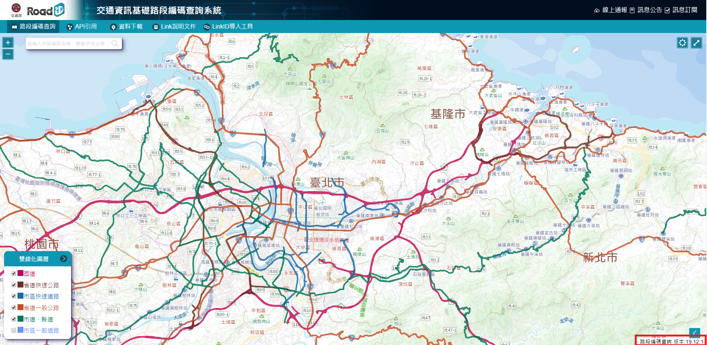
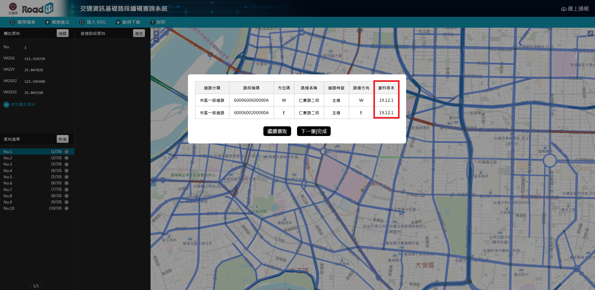
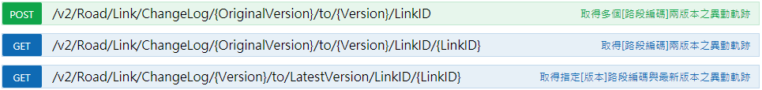
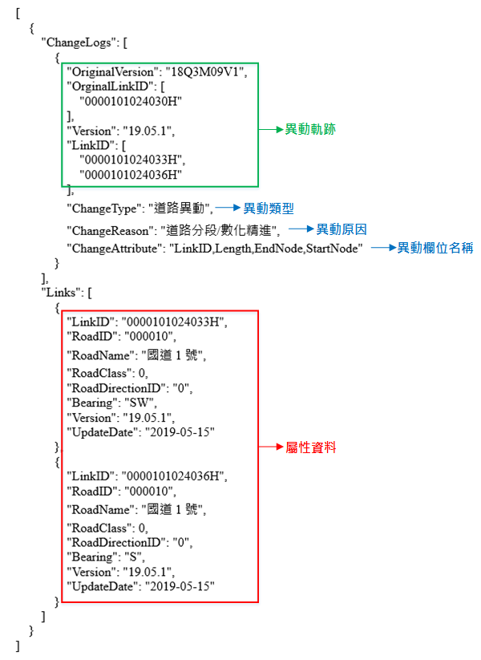

# 圖臺與LinkID導入工具

皆提供最新版資料，並註記目前使用之版本號。

# 異動紀錄

## 異動資料欄位

1\. 屬性資料：敘述道路或運輸場站(或其他對應檔)之基本資料。

2\. 版本：記錄版本控管，相關欄位為Version及UpdateDate。Version於每次圖資異動時全圖更新版號，UpdateDate則於實際資料發生異動時更新，版本紀錄方式說明如下圖。

3\. 異動原因：說明異動類型、異動原因及異動欄位名稱。

## 異動API

1\. 歷史版本查詢

* 使用情境：提供查詢歷史資料或特定版本路段基本資料。

* 查詢方式：輸入指定版本Version與LinkID。

2\. 版本差異查詢

* 使用對象：對應標的來源單位或不定期更新者。

* 使用情境：適合已完成首次對應之使用者，當LinkID更新後，可透過API查詢所需版本進行對應資料更新。

* 查詢方式：輸入指定兩版本版本1、版本2與LinkID。

* 輸出內容：屬性資料及版本。

* 實際案例：

&emsp;&emsp;* Input：

&emsp;&emsp;&emsp;&emsp;* OriginalVersion：18Q3M09V1

&emsp;&emsp;&emsp;&emsp;* LinkID：0000101024030H

&emsp;&emsp;&emsp;&emsp;* Version：19.05.1

&emsp;&emsp;* Output：

3\. 異動軌跡查詢

* 使用對象：研究單位、資料加值應用單位或長時間未更新者。

* 使用情境：透過查詢得知指定之歷次版本、每一路段之變化情形。

* 查詢方式：輸入指定兩版本版本1、版本5與LinkID。

* 輸出內容：異動軌跡、異動類型、異動原因、異動欄位名稱及屬性資料。

* 實際案例：

&emsp;&emsp;* Input：

&emsp;&emsp;&emsp;&emsp;* OriginalVersion：18Q3M09V1

&emsp;&emsp;&emsp;&emsp;* LinkID：0000101024030H

&emsp;&emsp;&emsp;&emsp;* Version：19.05.1

&emsp;&emsp;Output：

4\. 更新類型查詢：異動資料欄位包含異動註記欄位(N: 新增、M: 異動、D: 刪除)，可提供使用者將手邊現有版本資料批次更新為最新版本資料，更新資料之查詢方式如下圖。

* 實際案例：

&emsp;&emsp;* Input：

&emsp;&emsp;&emsp;&emsp;* Version：18Q3M09V1

&emsp;&emsp;&emsp;&emsp;* ChangeNote：D

&emsp;&emsp;* Output：

&emsp;&emsp;* Input：

&emsp;&emsp;&emsp;&emsp;* Version：19.05.1

&emsp;&emsp;&emsp;&emsp;* ChangeNote：N

&emsp;&emsp;* Output：

依據上方實際案例查詢出版本18Q3M09V1、ChangeNote為D之結果後，使用者可將其手邊該筆LinkID資料整筆刪除後，再依據版本19.05.1、ChangeNote為N之查詢結果，將其全部新增至手邊資料，即可將該筆LinkID資料更新為最新版本。

# 下載區

每次路段編碼更新皆會提供異動更新檔(含路段編碼、運輸場站、路況偵測設施等)，歷次更新之異動資料請至本網站資料下載區 (https://link.motc.gov.tw/DownloadFile) 下載。

# 路段編碼圖資申請

目前提供申請各版本路段編碼全圖檔案(.shp檔)，路段編碼圖資申請表請至本網站資料下載區 (https://link.motc.gov.tw/DownloadFile) 自行下載填寫用印後，寄至 10052 臺北市中正區仁愛路一段50號 交通部資訊中心。
