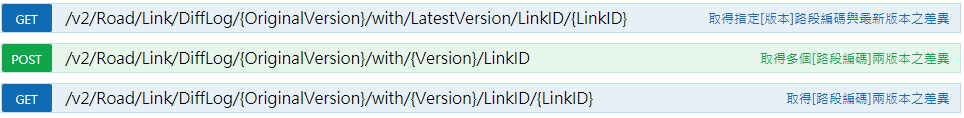
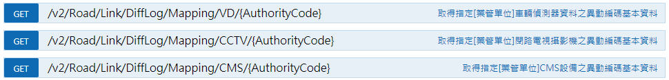
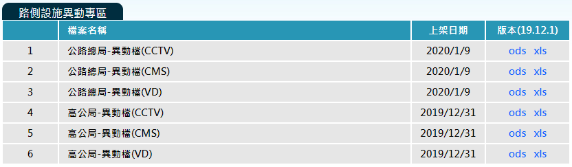

# 圖資更新方式

## 現有版本圖資更新

1\. 至本系統下載區索取「路段編碼異動檔」，進行現有版本圖資更新。

2\. 利用API進行前後版本異動更新，不提供跨版本查詢。

## 交通資訊對應更新

1\. API

* 目前提供查詢交通部高速公路局、交通部公路總局異動資料。

2\. 下載區

* 目前提供交通部高速公路局、交通部公路總局異動檔。

3\. 圖台查詢-歷史軌跡查詢

* 輸入版本、基礎路段代碼(LinkID)查詢局部異動狀態。

