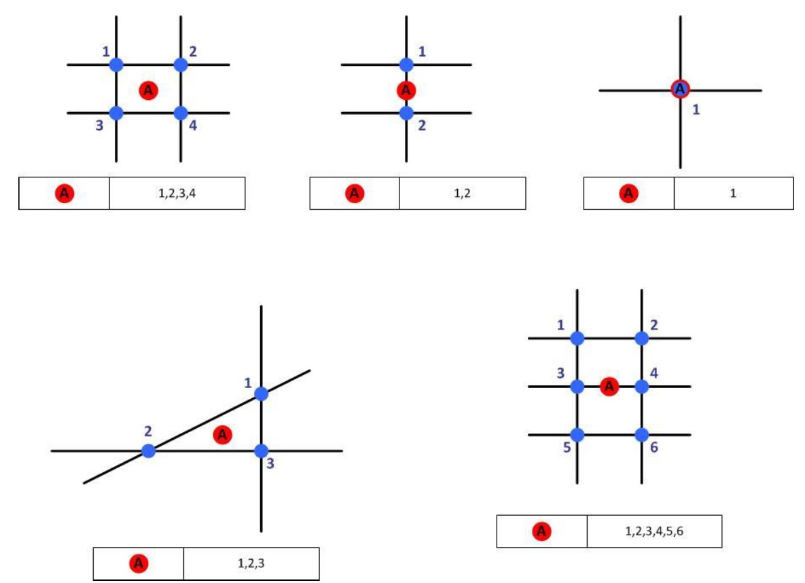
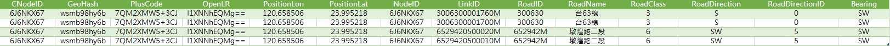
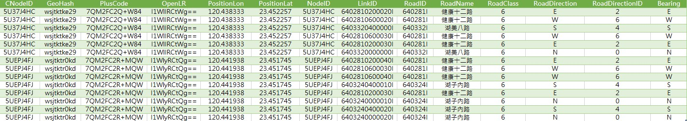

# API使用說明
 
## 路段基礎資料

### 查詢國道、省道快速公路、市區快速道路之路段編碼基本資料

* 服務構想：提供特定道路分類、特定區段之查詢方式，以快速取得所需要之路段編碼範圍。

* 資料範圍：國道、省道快速公路、市區快速道路與其交流道、匝道之路段編碼基本資料。

* 使用情境：
 
  1\. 取得「國道1號」、「基隆交流道」、「汐止交流道」取得基隆交流道至汐止交流道之間所有路段編碼基本資料。
  
  
  
  
  
  2\. 取得「國道1號」、「基隆交流道」取得所有基隆交流道之路段編碼基本資料。
  
  
  
  
    
  3\. 取得「台62線」、「暖暖交流道」取得所有暖暖交流道之路段編碼基本資料。
  
  
  
  
  
  4\. 取得「新北環河快速道路」、「新北環快與萬板大橋」取得所有新北環快與萬板大橋匝道之路段編碼基本資料。

  
  
  

* 效益：快速取得所需範圍之路段編碼基本資料。

## 路口虛擬中心點(CNode)資料

* 服務構想：「路口 」 在交通安全 、車流管理、路徑規劃等各應用領域中皆扮演相關重要角色，因此除目前已建立之路段編碼外，路口編碼在實務應用上亦有識別之需求。路口資料因路口數化方式之差異 而 使得一個路口 可能 由單一或多個NodeID組成 (如： 下圖之藍點 )，其組成的NodeID數量與型態均無法固定；以及NodeID編碼由坐標轉換而成，因此NodeID每次數化精進或改變單雙線之數化時皆可能造成該編碼的變動，故無法直接以NodeID做為識別真實世界之「路口」。基於上述原因，爰在「路口」處建立虛擬中心點(CNodeID)以滿足路口唯一及穩定之識別要素，並建立與路口道路分段點識別碼(NodeID)、相互關聯之路段編碼(LinkID)之空間關係。。

   

* 資料範圍：全台路口虛擬中心點(CNode)資料。

* 使用情境：利用不同查詢條件取得所需之路口虛擬中心點資料。

  1\. 取得「6J6NKX67」路口虛擬中心點資料。
  
   
  
  2\. 取得「6402810600030I」對應之路口虛擬中心點資料。
  
   
  
  3\. 取得「臺北市」、「民權東路六段,舊宗路一段」對應之路口虛擬中心點資料。
  
   
  
  4\. 取得「121.515497,25.076637」、「500公尺」對應之路口虛擬中心點資料。
  
   

* 效益：透過路口虛擬中心點(CNode)可與路段編碼(LinkID)相關聯，例如某一路口發生事故，可取得與該路口相關聯之LinkID，得知該事故可能影響之路段。
