# 前言

&emsp;&emsp;交通資訊(Traffic Information)除數據資料如車速、旅行時間、交通流量外，亦須載明所在之地理位置，對於交通資訊的使用者而言始具實質意義。地理位置的表示又稱為「位置參照(Location Reference)」，交通應用領域裡常使用「預碼法」作為交通資訊的位置參照。所謂「預碼法」是預先將特定的空間位置(如路段)給予唯一的編碼，欲參照某位置時，只須指明這個位置的編碼即可。為使路段編碼本身具有快速篩選的功能，以利交通資訊的查詢，路段編碼須進行多碼段結構化的設計，各碼段具有特定意義，即可快速檢索特定路段的交通資訊。結構化的路段編碼是查詢交通資訊時的一種索引，亦是各項交通資訊服務的共通基礎。

&emsp;&emsp;為因應未來多元資訊之蒐集、發布及交換之需求，交通部已針對全國主要道路訂定「全國交通資訊基礎路段編碼」規範進行「道路分段」與「路段編碼」，主要道路包括：國道、省道快速公路、市區快速道路(以上均含匝道，但不含服務區道路)、省道一般公路、縣道、鄉道、市區道路(不含機慢車道)；其中，市區道路以路名包含「路」與路寬15米(含)以上之「街」為對象，巷、弄、產業道路及無路名道路原則不納入第一階段交通資訊基礎路段之編碼範疇，惟有交通資訊發布需求（如路側設施布設、重要運輸場站位置及重要景點連絡道）之道路適當納入(以圖1為例：綠色線段為全國交通資訊基礎路段於市區部分的示意圖，淺藍色線段為巷弄未納入編碼範疇)。

# 1.名詞定義

&emsp;&emsp;「道路分段(Road Segmentation)」是指依交通資訊應用需求將實體路網切分成多個「路段(Link)」，為「交通資訊路況資訊交換之基本單位」。「路段節點(Node)」則為路段兩側端點或兩個以上路段的交會點。「交通資訊基礎路段」僅涵蓋主要道路，為實體路網的一部分，本文第3部分將詳細說明交通資訊基礎路段的選擇與道路分段的原則。以圖1臺北市路網為例，圓點即為「路段節點」，兩相鄰的「路段節點」之間的綠色線段即為「路段」。

&emsp;&emsp;「路段編碼」有名詞與動詞兩種意義，作名詞時(LinkID)，是指路段的識別索引(index)；作動詞時(Link Coding)，則為給定各路段索引之作業。由於交通資訊交換與查詢的特殊需求，同一個「路段」，會有多個不同的「路段編碼」(如共線)，因此，「路段編碼」作為路段識別索引並非是一種主索引(Primary Key)，而會是一個一對多(one-to-many)的外來索引(Foreign Key)。

# 2.道路編碼原則

## 2.1	圖資來源與道路類型

&emsp;&emsp;「交通資訊基礎路段」之原始道路圖資使用交通部與內政部共同發行之「臺灣通用電子地圖」為基礎。全國交通資訊基礎路段第一階段原則先涵納道路分類為國道、省道快速公路、市區快速道路(以上均含匝道)、省道一般公路、縣道、鄉道、市區（道路路名含「路」及路寬15米(含)以上的「街」），排除巷、弄，另將有交通資訊發布需求（如路側設施布設及易壅塞路段）之道路適當納入。

## 2.2	分向不分道原則

&emsp;&emsp;「交通資訊基礎路段」之路段考量方向性，同向道路不區分主副車道。現有臺灣通用電子地圖之路段是以道路中心線表示其幾何資料，可以單線表示兩個行車方向，亦可以雙線分別表示兩個相反方向，其中，不具分隔島的雙向道路以單線表示其道路中線(道路邊緣線等分中心之連線)；國道、省市快速道路、具分隔島之市區道路，以雙線表示不同車行方向之道路中線；如圖2的民生東路二段、松江路，道路具中央分隔島，故以雙線表示兩相反之車行方向，長春路、吉林路，則以單線表示兩個車行方向。

&emsp;&emsp;前述以雙線表示不同車行方向之路段，雙線將擁有個別的路段編碼。至於以單線表示兩車行方向之路段，則須將此類型線段進行複製及方向反轉，使其成為雙線各自擁有其路段編碼，同時以利未來道路資訊之發布與展示，複製及方向反轉後之路段示意圖如圖2所示。其中，吉林路、長春路於臺灣通用電子地圖皆為單線表示兩車行方向之道路(圖2的藍色線段)，而於「交通資訊基礎路段」應將這些線段進行複製及方向反轉，產生雙向之編碼(如圖2紅色線段所示方向)。

&emsp;&emsp;此外，由於臺灣通用電子地圖為數化方式之故，在兩雙線道路十字相交及雙線道路、單線道路相交處，將分別形成特殊井字形與雙十字的情形，這些交叉路乃由於數化所產生的短線段因不具實質意義，另迴轉道與轉彎道數化結果亦同如圖3所示，故不納入「交通資訊基礎路段」對象之中。

## 2.3	分段點類型

&emsp;&emsp;本規範主要以車輛行駛之重要路網為對象，第一階段優先以滿足交通路況交換需求為目標，以改變均勻車流之節點為「道路分段點」，原則以匝道(A1)、平交道(A2)、隧道(A3)、橋梁(A4)、平面道路路口(A5)、地下道(A6)與1公里路長上限(B1)等，外加縣市界(B2)等共計8類為分段點，並視應用之必要性進行調整。表1為道路分段點說明與範例一覽表。

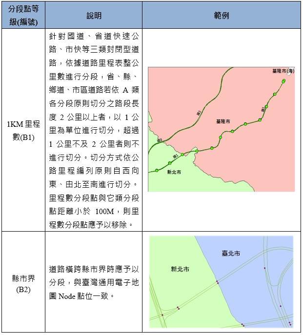

# 3.路段編碼定義

&emsp;&emsp;交通資訊基礎路段之編碼係為交通資訊變化頻繁且有大量查詢需求，故除考量編碼本身的識別性外，更重要的是應考量編碼的使用性(Usability)。圖4為交通資訊基礎路段編碼各碼段之定義，計有：道路分類碼(1碼)、路名碼(5碼)、道路特徵碼(1碼)、方向碼(1碼)、序號碼(5碼)與縣市碼(1碼)等6碼段共計主碼14碼，方位碼副碼1-2碼(副碼資訊記載於路段Link圖層屬性欄位中)，茲依各碼段分述如後。

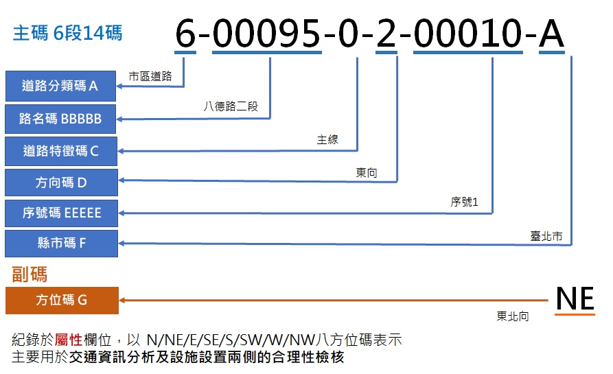

## 3.1	道路分類碼

&emsp;&emsp;道路分類碼為1碼數字，值域[0~6]，詳如表2。

&emsp;&emsp;分類碼0~2為具有匝道且多為高架形式的封閉型道路，分類碼3~6則為一般平面道路。道路分類的設計目的在便於中央與地方交管單位掌握各類道路路況，並依道路分類疏導壅塞。加值業者於進行長距離路線規劃時，可依道路分類進行分段式快速查詢。

## 3.2	路名碼

&emsp;&emsp;路名碼依不同道路分類有不同之編碼規則，茲分述如後。

1\. 國道、省道快速公路、省道一般公路、縣道

&emsp;&emsp;此四類道路之路名碼前4碼為主線編號，如: 國1為00010，國10為00100，全台共8條主線(另1條支線)，範圍自01至10。第5碼為主支線編號或特例(A,B,C…)，其中0表示主線，1\~9 為支線碼，分別代表[甲~壬] (甲:1, 乙:2,…)。表3至表6為國道、省道快速公路、省道一般公路、縣道路名碼範例。

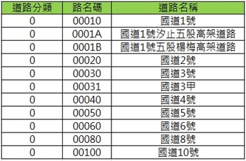

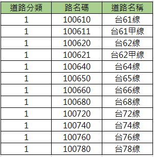

2\. 市區快速道路

&emsp;&emsp;市區快速道路之路名碼前4碼為流水號，第5碼為支線編號。前4碼流水號之編碼由交通部統一維護並發布。表7為市區快速道路路名碼範例。

3\. 鄉道(含區道)

&emsp;&emsp;第1碼為所屬縣市代碼。2~4碼為主線編號。第5碼為支線編號或特例，如專線、跨縣市鄉道(含區道)、跨縣市鄉道(含區道)支線等(以A,B,C…順序依序表示，A：第一條跨縣市道路、B為第二條依序表示)，下表為鄉道(含區道)路名碼範例。

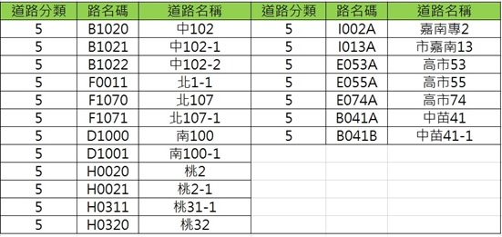

4\. 市區道路

&emsp;&emsp;5碼流水號，路名包含段數，如八德路一段與八德路二段之路名碼不同。全臺不重覆路名共約28,000條，因此利用5碼流水號對全臺路名進行流水號編列。市區道路路名流水號應以縣市為單位並針對既有路名進行編碼，如：臺北市路名碼為[1~4000]、新北市路名碼為[4001~10000]，依此類推。各縣市路名碼之範圍可預留新建道路空間，未來若不足時，再自路名碼最大值向後遞編。同縣市內路名碼可依中文路名進行排序，以利維護。市區道路路名碼之編碼須經交通部核定後統一發布並維護(表9為市區道路名統計與使用區間)。

&emsp;&emsp;此外，不同縣市或同縣市不同鄉鎮市區內之同名道路亦應擁有不同之路名碼，並於路名表之路名中註記其所屬鄉鎮市區以示區分。惟同縣市不同鄉鎮市區內之同名道路其路段連續時，則其路名碼編碼相同。圖5為同名道路不同鄉鎮市區之路名表編碼範例。

5\. 匝道

&emsp;&emsp;匝道路名碼依主線道路名稱或服務區/休息區名稱進行編列，圖6為國道匝道歸屬道路主線範例。

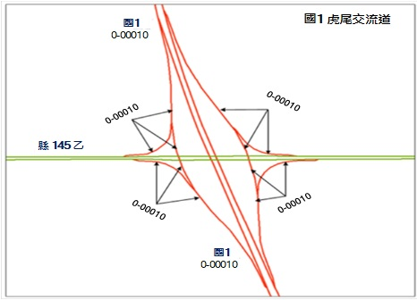

&emsp;&emsp;此外，當兩兩國道或國道與快速道路遇系統交流道相接時(如國1與國4)，因考量路名碼唯一之特性，因此當遇此一情況時，將重覆繪製道路並分別依道路所屬類別與路名進行編碼。

6\. 橋梁、隧道、地下道（以橋梁為例說明）

&emsp;&emsp;A.	同縣市橋梁

&emsp;&emsp;&emsp;&emsp;因考量其路名連續性，故以下列方式進行編碼：

&emsp;&emsp;&emsp;a.	當橋梁的兩側道路路名相同時，以道路名稱進行編碼。

&emsp;&emsp;&emsp;b.	若連接橋梁的兩側道路路名不同，且橋梁本身有路名者，則以路名編列路名碼。

&emsp;&emsp;&emsp;c.	若連接橋梁的兩側道路路名不同，且橋梁本身無路名者，以橋梁名編列路名碼。

&emsp;&emsp;&emsp;&emsp;隧道及地下道之路名碼編列方式亦同，圖8、圖9及表10為橋梁、隧道、地下道路名碼範例。

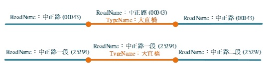

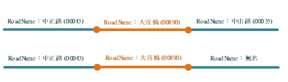

&emsp;&emsp;[註]：連接橋隧的兩側道路路名不同，且橋隧無路名時，將直接以橋隧名稱命名。

&emsp;&emsp;B.	跨縣市橋梁

&emsp;&emsp;&emsp;&emsp;跨縣市橋梁依分段原則，須於縣市界進行分段，其道路名稱依橋梁道路兩側命名相同及不同之狀況而依以下原則給予：

&emsp;&emsp;&emsp;a.	當連接橋梁的兩側道路路名相同時，將以道路名稱為各自縣市進行編碼；值得注意的是，因為各縣市之道路編碼範圍不同，故兩路段其編碼將不會相同。圖10為跨縣市橋梁-路名相同示意圖。

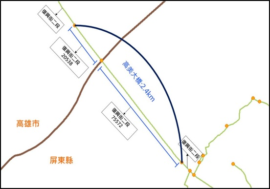

&emsp;&emsp;&emsp;b.	若連接橋梁的兩側道路之道路名稱不同，編碼以各自縣市、路名進行編列。圖11為跨縣市橋梁-路名不同示意圖。

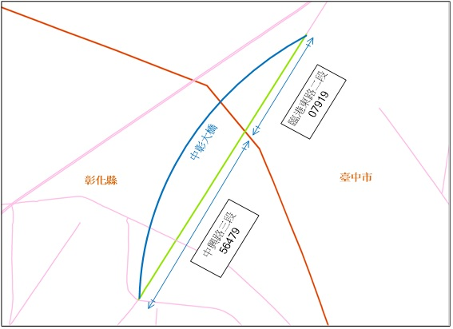

&emsp;&emsp;&emsp;c.	若橫跨縣市之橋梁本身無道路名稱時，編碼以橋梁名稱進行編列。值得注意的是，因為各縣市之道路編碼範圍不同，故兩路段其編碼將不會相同。

&emsp;&emsp;另為方便使用者蒐尋，資料庫欄位中增加「TypeName」一欄以記錄橋梁、隧道名稱，讓使用者可透過橋梁名或隧道名稱蒐尋至該橋梁、隧道。

7\. 圓環

&emsp;&emsp;圓環之路名碼以銜接之重要道路名稱由本案整併為單一名稱編列，惟業管單位有正式命名時，以正式名稱編列路名碼，圖13為圓環路名碼範例。

## 3.3	道路特徵碼

&emsp;&emsp;道路特徵碼為一碼數字，如表12。

&emsp;&emsp;因交通資訊基礎路段擁有特殊路段之需求，「道路特徵碼」用以紀錄匝道、主線及副線，後續並可擴充於特殊路段之需求，而對於同一條路名道路，不論主線/匝道/副線，其主「路名碼」將可保持一致性。其餘道路一般狀態下，道路特徵碼為0，但當同一路段同時有數個不同結構(相同路名)，則依實際狀態將地下道(或高架路段)、平面道路設為主副線，以茲區別。

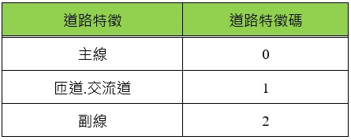

1\. 主線及副線

&emsp;&emsp;一般道路一般狀態下，道路特徵碼為0，但當同一路段同時有數個不同結構(相同路名)時，則依實際狀態將地下道(或高架路段)、平面道路設為主副線，以茲區別。

2\. 匝道及交流道

&emsp;&emsp;國道、省快、市快的交流道(匝道)之道路特徵碼為1、主線為0。

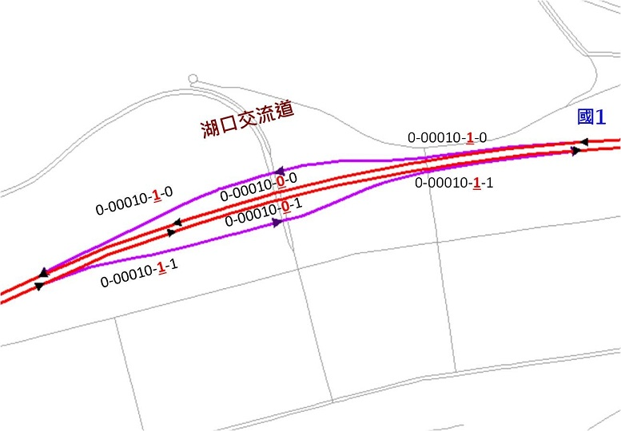

## 3.4	方向碼

&emsp;&emsp;依據交通資訊基礎路段分向不分道原則，基礎路段應依道路走向而編有1碼之方向碼。方向碼於公路（含市區快道路）以里程增減概分「順向」與「逆向」兩類，市區道路則為便於使用者方位認知，以道路於地圖實體方位碼區別，自北方順時針方向起算區分為8個方向，其代碼以0~7表示，另針對外環道及圓環有特殊之代碼。

1\. 國道、省道快速公路、市區快速道路、省道一般公路、縣道、鄉道(含區道)

&emsp;&emsp;A.	順向為「里程數增加的方向」，順向之方向碼為數字0。

&emsp;&emsp;B.	逆向為「里程數減少的方向」，逆向之方向碼為數字1。

2\. 市區一般道路

&emsp;&emsp;A.	以連續同一路名道路起點至迄點所產生之方向作為道路方向，自北方順時針方向起算區分為8個方向，其代碼以0~7表示，表示方式如圖17、圖18。

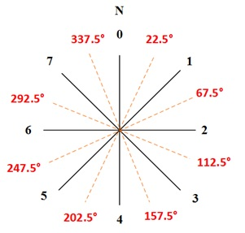

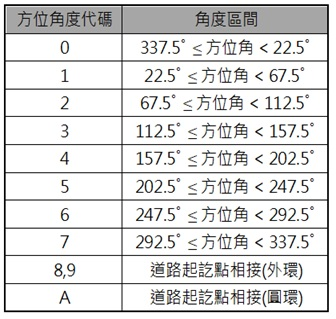

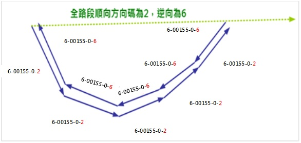

&emsp;&emsp;B.	外環道為起迄點相接之道路，且通常由多段道路銜接，其全路段之方向碼無法使用0-7表示，又因其特性相異於圓環。故新增專為表示外環道之方向碼，利用外環道路方向順向與逆向之分，將方向碼拆解成8及9。

&emsp;&emsp;C.	圓環車流方向一致，且無明顯道路起迄，無法準確定義其道路方向，方向碼以A表示。

3\. 匝道(含國道交流道及快速道路匝道)

&emsp;&emsp;以上游主線方向碼編列。國道交流道及市區快速道路匝道方向碼，主要依全路段主線走向進行編列，南北向及東西向之方向碼為順向0，反之則為逆向1。

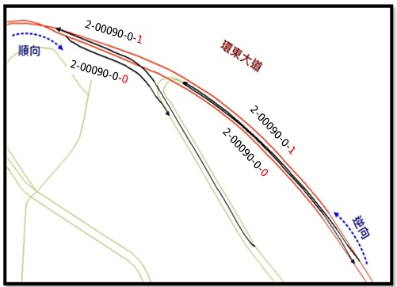

4\. 山區道路

&emsp;&emsp;刪除支線道路並以該道路之主線道路走向編列。

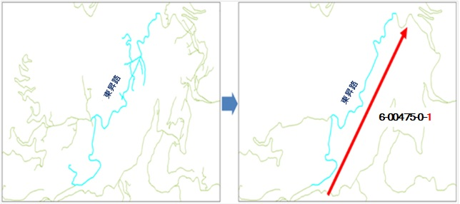

## 3.5	序號碼

&emsp;&emsp;序號碼為同名道路之路段次序(依方向碼順向分段及定義)，為5碼數字。序號碼定義依道路分類不同而異，表13為序號碼編碼基準，其他說明分述如後。

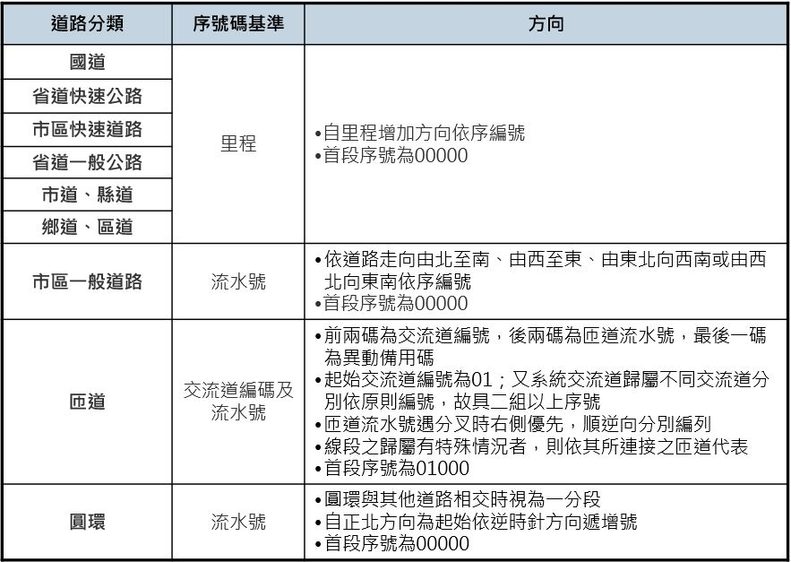

1\. 國道、省道快速公路、市區快速道路、省道一般公路、縣道、鄉道(含區道)

&emsp;&emsp;A.	以里程編碼，以AAAK+BB里程紀錄至10公尺。異動時直接以里程表示新的段點，其除可達到路段識別之目的外亦包含道路次序之特性。

&emsp;&emsp;B.	自里程數增加方向編號，配合路段起始點里程數，以10公尺為一單位。如：路段起始點里程數為25.4公里，該路段序號碼為02540，圖23為國道序號碼範例。

&emsp;&emsp;C.	首段序號為00000，雙向各自編號。

&emsp;&emsp;D.	新闢或刪除道路時，多半會在原路網產生新的分段點；原有道路縮減或改建時，則可能刪除原路網既有分段點，這些情況均會對原編碼產生變動，故有必要針對受影響之既有路段依里程進行編碼。

&emsp;&emsp;&emsp;a.	新增節點時，路段編碼依據新增節點之里程數，給予編碼。

&emsp;&emsp;&emsp;b.	刪除節點時，原路段編碼將暫時註銷(Disabled)。

2\. 市區一般道路：

&emsp;&emsp;依據道路走向由北至南、由西至東、由東北向西南或由西北向東南依序遞增進行編號，首段序號為00000，雙向各自編號，圖26為市區道路序號碼範例。

&emsp;&emsp;A.	編碼序號以00000,00010,00020……，可視為1組十位數號碼。

&emsp;&emsp;B.	異動時啟動個位數序號，以保持路段次序的特性。

&emsp;&emsp;C.	市區道路異動備用碼為第5碼數字，作為路段更新時使用。備用碼之使用可分「新增道路節點」與「刪除道路節點」兩種情況。

&emsp;&emsp;&emsp;a.	新闢道路時，多半會在原路網產生新的分段點，該這些情況均會對原編碼產生變動，故有必要針對受影響之既有路網進行更新。以圖27為例，原南京東路三段(路段編碼為6-00199-0-0-00020-A)中新增節點時，原路段編碼將暫時註銷(Disabled)，並於原路段產生兩個新路段，依據「路段編碼」備用碼之說明，新增1節點時，新增兩路段之備用碼為3與6。因此，新增路段之編碼分別為6-00199-0-0-00023-A與6-00199-0-0-00026-A。

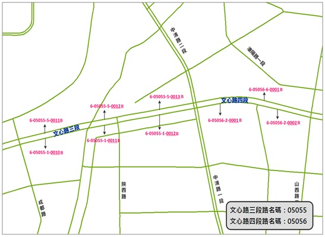

&emsp;&emsp;&emsp;b.	而當原有道路縮減或改建時，則可能刪除原路網既有分段點，該情況可能會對原編碼產生變動，故有必要針對受影響之既有路網進行更新。以圖28為例，原南京東路五段之兩路段編碼(路段編碼為6-00201-0-0-00020-A與6-00201-0-0-00030-A)須整併為單一路段編碼時，原有兩路段編碼需暫時註銷(Disabled)，並依據「路段編碼」備用碼之說明進行調整，故刪除1節點時，新路段之序號與備用碼為前後兩路段序號與備用碼組合之數字(此例為20與30)相加除以二(此例為25)，故新路段之編碼為6-00201-0-0-00025-A。

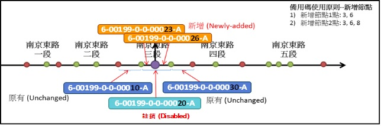

3\. 圓環

&emsp;&emsp;省道、縣道及鄉道共線遇圓環且與市區道路共線時，圓環屬省道、縣道及鄉道共線之道路分類不編碼，僅針對市區道路分類進行編碼，序號碼編碼方式依圓環與其他道路相交時分段，自正北方向為起始依逆時針方向遞增編列，首段序號為00000，圖29為圓環序號碼範例。圓環之編碼異動同市區一般道路異動原則。

4\. 交流道

&emsp;&emsp;依下述原則依序編列，圖30為交流道序號碼範例。

&emsp;&emsp;&emsp;A.	前2碼為交流道系統編號，後2碼為交流道流水號，第5碼為異動備用碼。

&emsp;&emsp;&emsp;B.	編碼序號以01000,01010,01020,……，可視為1組十位數號碼。

&emsp;&emsp;&emsp;C.	異動時啟動個位數序號之異動備用碼作業原則，以保持路段次序。

&emsp;&emsp;&emsp;&emsp;a.	依交流道出入口判斷，先編出口再編入口；

&emsp;&emsp;&emsp;&emsp;b.	依里程遞增遞減方向判斷，里程遞增先編，里程遞減後編；

&emsp;&emsp;&emsp;&emsp;c.	遇分叉路時，右側路段優先編號；

&emsp;&emsp;&emsp;&emsp;d.	若線段之歸屬有特殊情況者，則依其所連接之代表匝道(Ramp)進行編列。

5\. 市快匝道: 

&emsp;&emsp;並依下述原則依序編列，圖31為匝道序號碼範例。

&emsp;&emsp;&emsp;A.	前兩碼為市快交流道編號，後2碼為匝道流水號，第5碼為異動備用碼。

&emsp;&emsp;&emsp;B.	依匝道出入口判斷，先編出口再編入口。

&emsp;&emsp;&emsp;C.	依里程遞增遞減方向判斷，里程遞增先編，反之遞減後編。

## 3.6	縣市碼

&emsp;&emsp;縣市碼為路段所在縣市之代碼，其與地政司之縣市代碼一致，為大寫英文字母[A~Z] (L、R、S、Y保留)。表14為縣市碼一覽表。位於縣市界上之路段縣市碼，以車行方向右側行政區為準，範例如圖32所示。

## 3.7	方位碼

&emsp;&emsp;方位碼資訊記載於路段Link圖層屬性欄位中，輔助說明同一道路上各路段之方位，其目的用以判別路側設施、站牌相關應用等資訊之歸屬路段二側方向，以路段於地圖實體之方位，自北順時針起算共區分8個方位，以英文八方位簡碼表示。表示方式如圖33，範例如圖34。

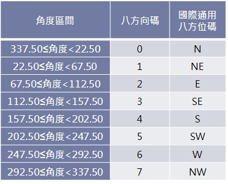

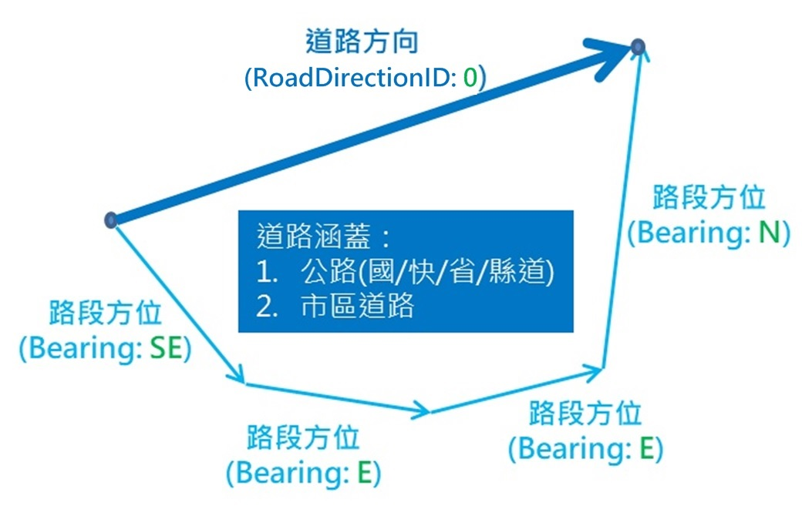

## 3.8	道路共線

&emsp;&emsp;由於部分路段同時隸屬多個不同的道路分類，致使同一路段會擁有多個路名(亦即所謂的「道路共線」)。基於路況使用的特殊需求(常以道路分類查詢路況)，有必要針對共線路段的不同道路分類給予不同的路段識別。故在圖資與編碼的處理上，共線但不同道路分類之路段將各自擁有路段圖資與編碼。此時，這些共線路段將相互參照(參照共線路段資料表)以保持對應。以臺北市忠孝東路1段部分路段為例，其同時為省道一般公路(臺5線)與市區一般道路(忠孝東路一段)，這些路段均擁有兩個不同道路分類與路名的路段編碼，其編碼前6碼之範例圖35所示。

# 4.編碼更新

&emsp;&emsp;道路更新時，道路分段與編碼皆需更新。編碼異動情形計有以下三類：

&emsp;&emsp;一、新增路段或節點：如新建道路、新增易壅塞路段等。

&emsp;&emsp;二、	刪除路段或節點：如道路因災害而拆遷等。

&emsp;&emsp;三、	編碼修正：如路名或行政區異動、里程數調整等。

&emsp;&emsp;新闢道路除新道路本身應依「道路分段」原則進行道路分段與編碼外，與原有路網相接部分應一併檢視是否會對原路網分段產生新節點。若有，則須對新增與既有編碼之路段進行更新。

&emsp;&emsp;編碼更新作業請參考「路段編碼」序號碼說明。由於前述編碼之特殊設計(路名碼、特徵碼、序號碼、以里程數為分段原則)皆有考慮路段更新情形，因此，各類道路路段更新後的編碼異動將僅限於局部路段，使用者僅需針對異動路段重新進行比對。

&emsp;&emsp;新闢道路與道路整併時將影響其道路名稱之編列，為有效紀錄其變動情形與過程，路名表應有一更新狀態之註記欄位及更新日期欄位，並於路名表維護更新時一併註記更新狀態與更新日期，更新狀態共有N(新增)、M(修改)、D(刪除)三種，相關應用情形如下範例說明。

&emsp;&emsp;(一\)新闢道路

&emsp;&emsp;&emsp;路名表依其所屬道路分類之路名碼編列原則新增編列路名碼。當為市區道路時，依其所屬縣市路名碼使用區間中，目前使用之最大號碼向下編列，並於更新狀態欄位註記為「N」。

&emsp;&emsp;(二\)單一道路更換路名

&emsp;&emsp;&emsp;將該道路於路名表中之更新異動，完成後註記其更新狀態為「M」，此類情形於並無調整空間資料，該路段之編碼須重新編碼，且於路名表上進行更新與調整。

&emsp;&emsp;(三\)多條道路整併為一新路名

&emsp;&emsp;&emsp;以臺中市先前道路整併為例，中正路、中港路、中棲路整併為臺灣大道，則應將中正路、中港路、中棲路分別於路名表中註記其更新狀態為「D」，並於路名表中新增臺灣大道之路名碼，註記其更新狀態為「N」。

&emsp;&emsp;(四\)多條道路整併為其中之一路名

&emsp;&emsp;&emsp;以新北市中和區中正路與景平路整併為中正路為例，應將景平路於路名表中註記更新狀態為「D」，但中正路於路名表中無需做任何異動。

# 5.路段節點編碼原則

&emsp;&emsp;路段節點之編碼直接採用「臺灣通用電子地圖」道路節點識別碼(NodeID)之編碼方式，不另行編碼。以下概略說明「臺灣通用電子地圖」道路節點識別碼之編碼方式，詳細編碼內容請見「臺灣通用電子地圖使用手冊」。

&emsp;&emsp;「臺灣通用電子地圖」道路節點識別碼係利用道路節點的TWD97 TM2 121度坐標(EPSG:3826)進行32位元轉碼。考量數化的人為誤差，道路節點距離2.5米以內視為同1點。TWD97 TM2 121度坐標投影採用10萬公尺方格帶，X坐標為6位整數，Y坐標為7位整數。進行32位元編碼前， Y坐標減2000000。例如：臺北市某點坐標為(300500, 2770000)，將Y坐標減去2000000，故轉換前的參考坐標成為(300500,770000) 。32 進位代碼定義如下：

&emsp;&emsp;「0,1,2,3,4,5,6,7,8,9,A,B,C,D,E,F,G,H,J,K,L,M,N,P,Q,R,S,T,U,V,W,X 」，其中字母 I、O不用，避免和數字混淆，代碼對應如表15所示：

&emsp;&emsp;前述參考坐標(300500,770000)分別以 32 進位計算，可得如下轉換值：

&emsp;&emsp;300500->95EL；770000-->PFWG，兩字串相加可得 95ELPFWG，共計8位數。

# 6.路段編碼補充

&emsp;&emsp;道路名稱基本資料(Road)為同路名之連續道路組合，同路名但隸屬不同行政區(縣市)之市區道路應予以分段，其路名碼相同。其Link與Road的關聯性如下圖所示：

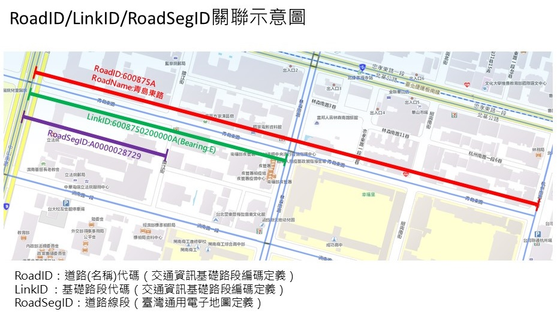

&emsp;&emsp;道路代碼(RoadID)依公路及市區道路分為下列兩種顯示方式，其道路代碼關係圖及相關說明如下：

&emsp;&emsp;一、公路(含市快)：RoadClass(1碼) + RoadNameID(5碼)

&emsp;&emsp;二、市區道路：RoadClass(1碼) + RoadNameID(5碼) + CityID(1碼)

