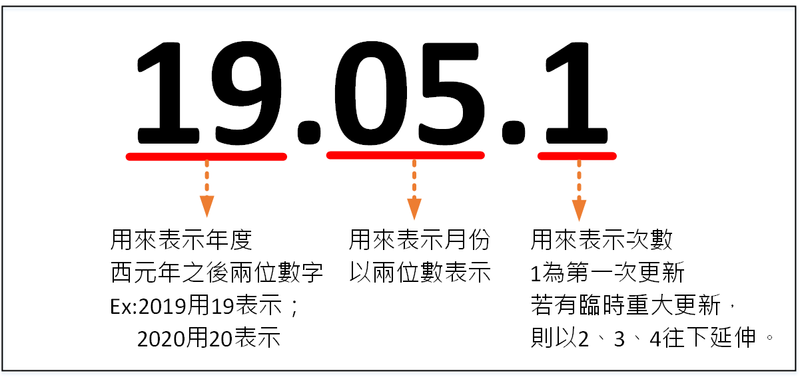

# 更新週期

## 一、「定期」更新

### &emsp;1. 異動中繼檔更新

&emsp;&emsp;* 係以國土測繪中心提供之臺灣通用電子地圖異動中繼檔案進行異動比對更新。

### &emsp;2. 全圖比對更新

&emsp;&emsp;* 係以國土測繪中心提供之臺灣通用電子地圖完整版進行全圖比對更新

## 二、「重大不定期」更新異動作業

* 若有較重要或急迫需立即進行發佈之路段區域，則立即於當月進行編碼更新處理。

# 歷次版本

* Version：18Q3M09V1；UpdateDate：2018-09-28。

* Version：19.05.1；UpdateDate：2019-05-15。

* Version：19.12.1；UpdateDate：2019-12-20。

* Version：19.12.2；UpdateDate：2020-04-20。

* Version：20.07.1；UpdateDate：2020-07-20。

# 版本設計說明

