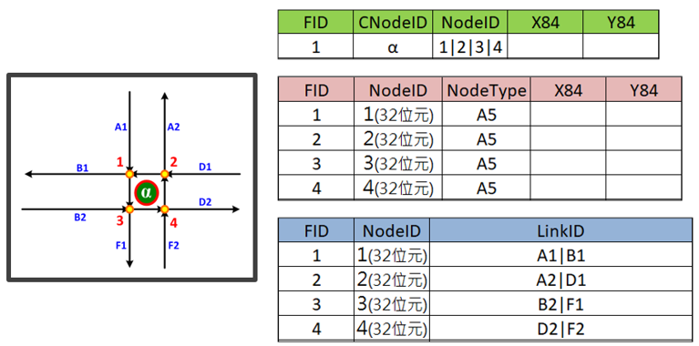
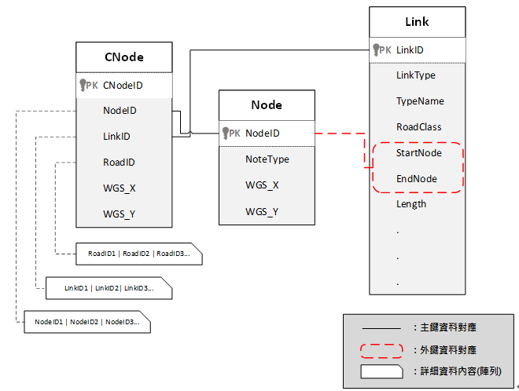

* 道路分段點關聯資料係描述路口道路分段點與相關路段之空間關係，其內容應包含路口道路分段點識別碼(NodeID)、相互關聯之路段編碼(LinkID)，藉此得知路口道路分段點與相關路段關係。

* 惟NodeID乃直接引用自臺灣通用電子地圖資料，該編碼由坐標轉換而成，因此NodeID每次數化精進或改變單雙線之數化時皆可能造成該編碼的變動，故無法直接以NodeID做為識別真實世界之「路口」，爰在「路口」處建立虛擬中心點(CNodeID)以滿足路口唯一及穩定之識別要素。

* 本計畫虛擬中心點(CNodeID)暫以32位元碼作為主碼，副碼則提供GeoHash與Open Location Code網格資料，並建立與路口道路分段點識別碼(NodeID)、相互關聯之路段編碼(LinkID)之空間關係。

