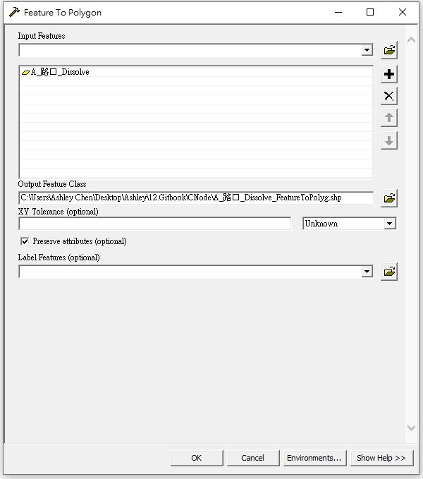

# 關聯說明

* 道路分段點關聯資料係描述路口道路分段點與相關路段之空間關係，其內容應包含路口道路分段點識別碼(NodeID)、相互關聯之路段編碼(LinkID)，藉此得知路口道路分段點與相關路段關係。

* 惟NodeID乃直接引用自臺灣通用電子地圖資料，該編碼由坐標轉換而成，因此NodeID每次數化精進或改變單雙線之數化時皆可能造成該編碼的變動，故無法直接以NodeID做為識別真實世界之「路口」，爰在「路口」處建立虛擬中心點(CNodeID)以滿足路口唯一及穩定之識別要素。

* 本計畫虛擬中心點(CNodeID)暫以32位元碼作為主碼，副碼則提供GeoHash與Open Location Code網格資料，並建立與路口道路分段點識別碼(NodeID)、相互關聯之路段編碼(LinkID)之空間關係。

# CNode產製方式

一、於ArcGIS內對Link圖層執行條件式選取出路口，條件式為 "Linktype" = '路口'。

二、將選取出之路口執行「Dissolve」功能，勾選「Linktype」欄位，並取消勾選「Create multipart features」。

執行結果如下圖，紅色線段即所選出之路口範圍。

三、將步驟二所產出之圖層，執行「Feature To Polygon」功能，使其轉換成面圖層。

執行結果如下圖粉色範圍。

四、為使相連的路口合為一個路口，因此將步驟三所產出之圖層，執行「Dissolve」功能，，並取消勾選「Create multipart features」。

執行結果可將相連合併為單一路口，如下圖黑色圓圈所示。

五、由於路口並非全是面圖層，亦存在單線段狀態之路口，因此須將步驟四所產出之圖層，與步驟二所產出之圖層進行「Select By Location」，並設定intersect buffer為0.0001m，完成後再做「反向選取」抓出為單線狀態之路口，如藍色線段框出範圍。

六、將步驟五所抓出之單線狀態路口執行「Buffer」功能，使線段可轉變為面圖層之狀態。

七、將步驟四與步驟六所產出之圖層進行「Merge」功能，使兩圖層合為同一圖層。

八、將步驟七所產出之圖層執行「Feature To Point」功能，並勾選「Inside」，即可產出中心點，結果則為本計畫所用之路口虛擬中心點(CNode)，如下圖黑點。

