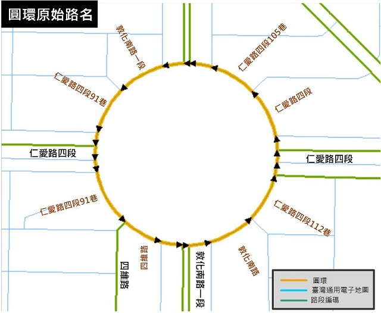
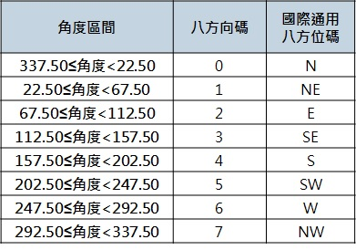

# 路段編碼原則

## 一般路段：分向不分道

  
  
  \*單行道：雙向編碼，惟status：不啟用。

## 虛擬線段：不具實質意義，不編碼

  

  \*由人工挑選路口及迴轉道線段，並予以標註。
  

# 路段編碼說明

# 道路分類碼

* 道路分類依臺灣通用電子地圖之道路等級碼為依據進行編碼。
* 分類碼0至2為具有匝道之封閉型道路，3至6則為平面道路。

  

  
  

# 路名碼

* 每個道路有其專屬對應名稱與號碼。
* 依道路分類各自編訂路名碼，市區道路又依所屬縣市各自道路名稱筆畫數排序編碼。

  

  

\*無名道路：暫由本案編訂，後續有官方正式公告路名將配合調整

* 路名碼範例

  

  

  

  

  

* 路名碼範例：圓環

  市區道路之圓環通常銜接多條道路，為考量實務上圓環為一完整之道路及路名常用性，使其可於路名碼編列時以其銜接之重要道路名稱由本案暫自行命名編列。

  

  

# 道路特徵碼

* 道路特徵碼﹕國道、省快、市快的交流道\(匝道\)之道路特徵碼為1，主線為0，副線為2。
* 其餘道路一般狀態下，道路特徵碼為0，但當同一路段同時有數個不同結構\(相同路名\)，則依實際狀態將地下道\(或高架路段\)設為主線，平面道路設為主副線，以茲區別。

  
  

  
  
  

  
  

  
  
  
# 方向碼及方位碼

## 道路「方向碼」與路段「方位碼」

* 道路「方向」指連續同一路名道路起點至迄點全路段所產生之方向，通常由多個基礎路段所組成。
* 路段「方位」則指每一個基礎路段產生之方位。

  

  

  

* __方向碼__： 
  
  1\. __公路__：依道路里程遞增方向區分順逆，遞增為順向0、逆向1。 
  
  2\. __市區快速道路__：依全路段走向判別，南北向及東西向為順向0，逆向1。 
  
  3\. __市區道路\(一般\)__：依道路起迄點方向定義，共8個方向\(0-7\)。 
  
  4\. __市區道路\(外環\)__：道路起迄相接，順逆時鐘分別以8,9表示。 
  
  5\. __市區道路\(圓環\)__：道路起迄相接，以A表示方向碼。
  
  
* __方位碼__：記錄於屬性輔助表示各路段方位，以英文八方位簡碼表示。

  

  

* __方向碼範例__：市區快速道路匝道

  市快匝道之方向碼，主要同上游主線，依全路段走向判別方向性，南北向及東西向為順向0，反之逆向1。

  

* __方向碼範例__：外環道、圓環

   
  
  
  起迄點相接之道路，利用外環道路方向順向與逆向區分，以代碼8及9表示。
  
  
  
  
  
  起迄點相接之道路，難以定義其代表之實體方位，且圓環之車行方向一致為逆時鐘方向，並無例外，故以代碼A表示。 

* __方向碼範例__：山區道路取主線

  同名道路分支道太多，拉出主線，刪除多餘分支道路，進行方向碼判別。

  
  

# 序號碼

* 同一道路多線段組成者依序編號給予唯一值。

  

  

* 序號碼\(含備用碼\)：5碼，指同名道路之路段次序。

  __1. 公路__：以**里程**編碼，AAABB。

   \(1\) AAAK+BB里程紀錄至10公尺

   \(2\) 異動直接以里程表示新的段點，故仍具路段次序的特性。

  __2. 市區道路__：以**流水號**編碼，AAAAB，B為異動備用碼。

   \(1\) 編碼序號以00000,00010,00020……，可視為1組十位數號碼。

   \(2\) 異動時啟動個位數序號，以保持路段次序的特性。

  __3. 匝道__：以**流水號**編碼，AABBC。

   \(1\) AA為交流道編號，BB為匝道流水號，C為異動備用碼。

   \(2\) 編碼序號以01000,01010,01020,……，可視為1組十位數號碼。

   \(3\) 異動時啟動個位數序號之異動備用碼作業原則，以保持路段次序。

  __4. 市區道路序號碼內之「異動備用碼」__：AAAAB，B為異動備用碼。

   \(1\) 為1碼數字，市區道路路段更新時使用，其與序號碼最後一碼可視為1組十位數號碼，使於節點增刪後仍可顯示路段次序關係。

   \(2\) 新增節點1點時，備用碼為3, 6；新增2點時為3, 6, 8。

   \(3\) 刪除節點1點時，備用碼為前後節點之平均。刪除2節點時則為前後節點之平均再加5。
   

  
  
  

  __5. 序號碼範例__：公路、市區道路、圓環

  
  

  
  

  
  

  __6. 序號碼範例__：高快速公路交流道

   \(1\) 前兩碼為交流道編號，後兩碼為匝道流水號。
   
   \(2\) 遇分叉時右側優先。

   \(3\) 系統交流道歸屬不同交流道分別依原則編號。

  
  

  
  
  
  
  

  __7. 序號碼範例__：市區快速道路匝道

   \(1\) 前兩碼為市快交流道編號，後兩碼為匝道流水號。
   
   \(2\) 依匝道出入口判斷，先編出口再編入口。

   \(3\) 里程遞增遞減方向判斷，里程遞增先編，反之遞減後編。

  
  

# 縣市碼

* 為路段所在縣市之代碼，其值與地政司縣市代碼一致，為大寫英文字母\[A~Z\] \(L、R、S、Y保留\)。

  

  
  
  
# 補充：RoadID與LinkID關係說明

* LinkID = 基礎路段代碼
* RoadID = 道路代碼

  > 公路\(含市快\)：RoadClass \(1碼\)+RoadNameID\(5碼\)
  >
  > 市區道路：RoadClass \(1碼\)+RoadNameID\(5碼\)+CityID\(1碼\)

# 補充：RoadID/LinkID/RoadSegID關聯示意圖

* RoadID：道路(名稱)代碼（交通資訊基礎路段編碼定義）

* LinkID ：基礎路段代碼（交通資訊基礎路段編碼定義）

* RoadSegID：道路線段（臺灣通用電子地圖定義）
