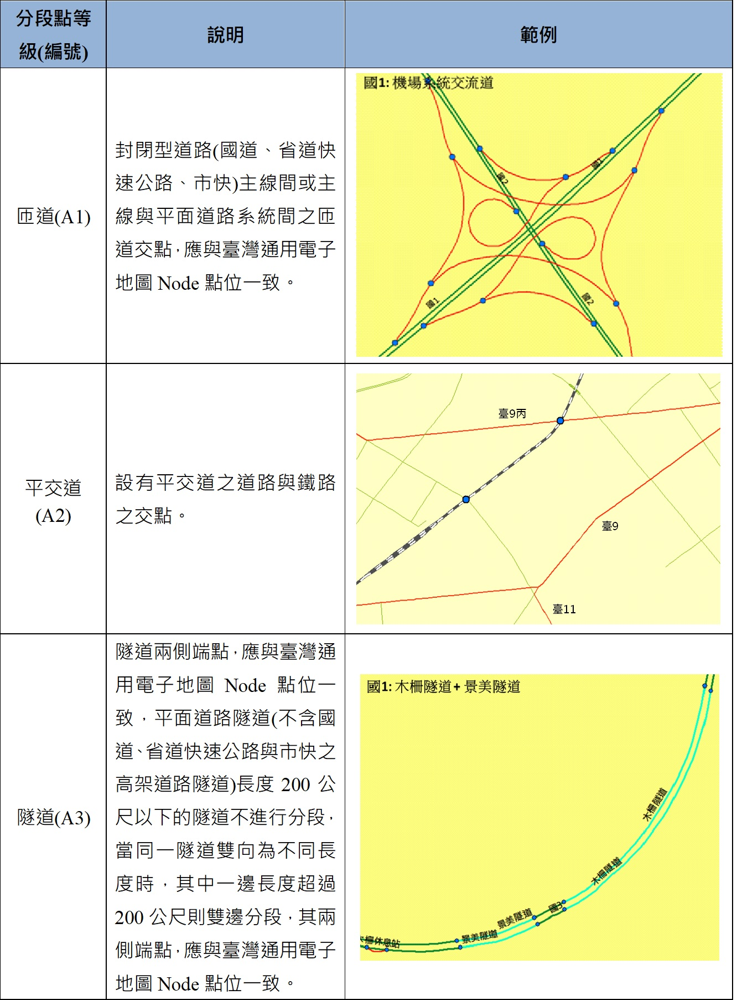
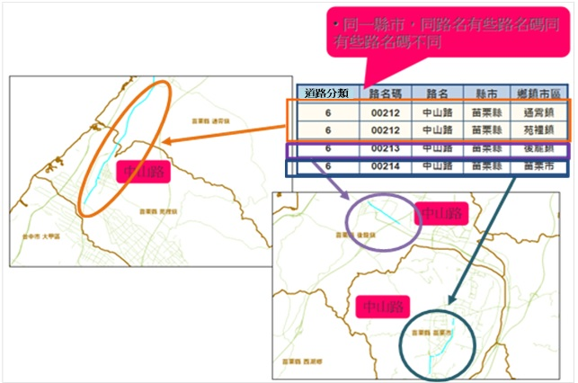

# 前言

&emsp;&emsp;交通資訊(Traffic Information)除數據資料如車速、旅行時間、交通流量外，亦須載明所在之地理位置，對於交通資訊的使用者而言始具實質意義。地理位置的表示又稱為「位置參照(Location Reference)」，交通應用領域裡常使用「預碼法」作為交通資訊的位置參照。所謂「預碼法」是預先將特定的空間位置(如路段)給予唯一的編碼，欲參照某位置時，只須指明這個位置的編碼即可。為使路段編碼本身具有快速篩選的功能，以利交通資訊的查詢，路段編碼須進行多碼段結構化的設計，各碼段具有特定意義，即可快速檢索特定路段的交通資訊。結構化的路段編碼是查詢交通資訊時的一種索引，亦是各項交通資訊服務的共通基礎。

&emsp;&emsp;為因應未來多元資訊之蒐集、發布及交換之需求，交通部已針對全國主要道路訂定「全國交通資訊基礎路段編碼」規範進行「道路分段」與「路段編碼」，主要道路包括：國道、省道快速公路、市區快速道路(以上均含匝道，但不含服務區道路)、省道一般公路、縣道、鄉道、市區道路(不含機慢車道)。

&emsp;&emsp;市區道路包含「路」與路寬15米(含)以上之「街」道，並排除巷、弄，其中，產業道路及無路名道路原則不納入第一階段交通資訊基礎路段之編碼範疇，惟有交通資訊發布需求（如路側設施布設、重要運輸場站位置及重要景點連絡道）之道路適當納入(以圖1為例：綠色線段為全國交通資訊基礎路段於市區部分的示意圖，淺藍色線段為巷弄)。

# 1.名詞定義

&emsp;&emsp;「道路分段(Road Segmentation)」是指依交通資訊應用需求將實體路網切分成多個「路段(Link)」，為「交通資訊路況資訊交換之基本單位」。「路段節點(Node)」則為路段兩側端點或兩個以上路段的交會點。「交通資訊基礎路段」僅涵蓋主要道路，為實體路網的一部分，本文第3部分將詳細說明交通資訊基礎路段的選擇與道路分段的原則。以圖1臺北市路網為例，圓點即為「路段節點」，兩相鄰的「路段節點」之間的綠色線段即為「路段」。

&emsp;&emsp;「路段編碼」有名詞與動詞兩種意義，作名詞時(LinkID)，是指路段的識別索引(index)；作動詞時(Link Coding)，則為給定各路段索引之作業。由於交通資訊交換與查詢的特殊需求，同一個「路段」，會有多個不同的「路段編碼」(如共線)，因此，「路段編碼」作為路段識別索引並非是一種主索引(Primary Key)，而會是一個一對多(one-to-many)的外來索引(Foreign Key)。

# 2.道路編碼原則

## 2.1	圖資來源與道路類型

&emsp;&emsp;「交通資訊基礎路段」之原始道路圖資使用交通部與內政部共同發行之「臺灣通用電子地圖」為基礎。全國交通資訊基礎路段第一階段原則先涵納道路分類為國道、省道快速公路、市區快速道路(以上均含匝道)、省道一般公路、縣道、路名含「街」之路寬15米(含)以上的市區道路，但排除巷、弄，另將有交通資訊發布需求（如路側設施布設及易壅塞路段）之道路適當納入。

## 2.2	分向不分道原則

&emsp;&emsp;「交通資訊基礎路段」之路段考量方向性，同向道路不區分主副車道。現有臺灣通用電子地圖之路段是以道路中心線表示其幾何資料，可以單線表示兩個行車方向，亦可以雙線分別表示兩個相反方向，其中，不具分隔島的雙向道路以單線表示其道路中線(道路邊緣線等分中心之連線)；國道、省市快速道路、具分隔島之市區道路，以雙線表示不同車行方向之道路中線；如圖2的民生東路二段、松江路，道路具中央分隔島，故以雙線表示兩相反之車行方向，長春路、吉林路，則以單線表示兩個車行方向。

&emsp;&emsp;前述以雙線表示不同車行方向之路段，雙線將擁有個別的路段編碼。至於以單線表示兩車行方向之路段，則須將此類型線段進行複製及方向反轉，使其成為雙線各自擁有其路段編碼，同時以利未來道路資訊之發布與展示，複製及方向反轉後之路段示意圖如圖2所示。其中，吉林路、長春路於臺灣通用電子地圖皆為單線表示兩車行方向之道路(圖2的藍色線段)，而於「交通資訊基礎路段」應將這些線段進行複製及方向反轉，產生雙向之編碼(如圖2紅色線段所示方向)。

&emsp;&emsp;此外，由於臺灣通用電子地圖為數化方式之故，在兩雙線道路十字相交及雙線道路、單線道路相交處，將分別形成特殊井字形與雙十字的情形，這些交叉路乃由於數化所產生的短線段因不具實質意義，另迴轉道與轉彎道數化結果亦同如圖3所示，故不納入「交通資訊基礎路段」對象之中。

## 2.3	分段點類型

&emsp;&emsp;本規範主要以車輛行駛之重要路網為對象，第一階段優先以滿足交通路況交換需求為目標，以改變均勻車流之節點為「道路分段點」，原則以匝道(A1)、平交道(A2)、隧道(A3)、橋梁(A4)、平面道路路口(A5)、地下道(A6)與1公里路長上限(B1)等，外加縣市界(B2)等共計8類為分段點，並視應用之必要性進行調整。表1為道路分段點說明與範例一覽表。

# 3.路段編碼定義

&emsp;&emsp;交通資訊基礎路段之編碼係為交通資訊變化頻繁且有大量查詢需求，故除考量編碼本身的識別性外，更重要的是應考量編碼的使用性(Usability)。圖4為交通資訊基礎路段編碼各碼段之定義，計有：道路分類碼(1碼)、路名碼(5碼)、道路特徵碼(1碼)、方向碼(1碼)、序號碼(5碼)與縣市碼(1碼)等6碼段共計主碼14碼，方位碼副碼1-2碼(副碼資訊記載於路段Link圖層屬性欄位中)，茲依各碼段分述如後。

## 3.1	道路分類碼

&emsp;&emsp;道路分類碼為1碼數字，值域[0~6]，詳如表2。

&emsp;&emsp;分類碼0~2為具有匝道且多為高架形式的封閉型道路，分類碼3~6則為一般平面道路。道路分類的設計目的在便於中央與地方交管單位掌握各類道路路況，並依道路分類疏導壅塞。加值業者於進行長距離路線規劃時，可依道路分類進行分段式快速查詢。

## 3.2	路名碼

&emsp;&emsp;路名碼依不同道路分類有不同之編碼規則，茲分述如後。

1\. 國道、省道快速公路、省道一般公路、縣道

&emsp;&emsp;此四類道路之路名碼前4碼為主線編號，如: 國1為00010，國10為00100，全台共8條主線(另1條支線)，範圍自01至10。第5碼為主支線編號或特例(A,B,C…)，其中0表示主線，1\~9 為支線碼，分別代表[甲~壬] (甲:1, 乙:2,…)。表3至表6為國道、省道快速公路、省道一般公路、縣道路名碼範例。

2\. 市區快速道路

&emsp;&emsp;市區快速道路之路名碼前4碼為流水號，第5碼為支線編號。前4碼流水號之編碼由交通部統一維護並發布。表7為市區快速道路路名碼範例。

3\. 鄉道(含區道)

&emsp;&emsp;第1碼為所屬縣市代碼。2~4碼為主線編號。第5碼為支線編號或特例，如專線、跨縣市鄉道(含區道)、跨縣市鄉道(含區道)支線等(以A,B,C…順序依序表示，A：第一條跨縣市道路、B為第二條依序表示)，下表為鄉道(含區道)路名碼範例。

4\. 市區道路

&emsp;&emsp;5碼流水號，路名包含段數，如八德路一段與八德路二段之路名碼不同。全臺不重覆路名共約28,000條，因此利用5碼流水號對全臺路名進行流水號編列。市區道路路名流水號應以縣市為單位並針對既有路名進行編碼，如：臺北市路名碼為[1~4000]、新北市路名碼為[4001~10000]，依此類推。各縣市路名碼之範圍可預留新建道路空間，未來若不足時，再自路名碼最大值向後遞編。同縣市內路名碼可依中文路名進行排序，以利維護。市區道路路名碼之編碼須經交通部核定後統一發布並維護(表9為市區道路名統計與使用區間)。

&emsp;&emsp;此外，不同縣市或同縣市不同鄉鎮市區內之同名道路亦應擁有不同之路名碼，並於路名表之路名中註記其所屬鄉鎮市區以示區分。惟同縣市不同鄉鎮市區內之同名道路其路段連續時，則其路名碼編碼相同。圖5為同名道路不同鄉鎮市區之路名表編碼範例。

5\. 匝道

&emsp;&emsp;匝道路名碼依主線道路名稱或服務區/休息區名稱進行編列，圖6為國道匝道歸屬道路主線範例。

&emsp;&emsp;此外，當兩兩國道或國道與快速道路遇系統交流道相接時(如國1與國4)，因考量路名碼唯一之特性，因此當遇此一情況時，將重覆繪製道路並分別依道路所屬類別與路名進行編碼。

6\. 橋梁、隧道、地下道（以橋梁為例說明）

&emsp;&emsp;A.	同縣市橋梁

&emsp;&emsp;&emsp;&emsp;因考量其路名連續性，故以下列方式進行編碼：

&emsp;&emsp;-跨縣市橋梁

&emsp;&emsp;盤點全台橋梁樑發現跨縣市橋梁會有道路兩側命名不同之狀況。因此若連接橋梁的兩側道路路名不同者，且橋梁本身無路名者，以連接橋梁兩側之道路名為各自路名編列路名碼；當市區道路無路名之橋梁遇到跨縣市時，將以橋梁名併入各縣市原路名碼中。下圖為跨縣市橋梁示意圖。為方便使用者蒐尋於資料庫欄位中增加「Typename」一欄以記錄橋梁、隧道名稱，讓使用者可透過橋梁名或隧道名稱蒐尋至該橋梁、隧道。

7\. 圓環

&emsp;&emsp;圓環之路名碼以銜接之重要道路名稱由本案整併為單一名稱編列，惟業管單位有正式命名時，以正式名稱編列路名碼，下圖為圓環路名碼範例。

