# 壹、資料前處理

* 處理時機：當使用者僅有設備點位資料表格，無 .shp圖檔。

  一、將設備點位資料檔案(須含經緯度座標)轉換成點圖層，並存成 .xls檔案格式。
  
   * **注意：每一筆資料須給定唯一一個ID編號，以利後續進行Link圖層對應。**
     
     
  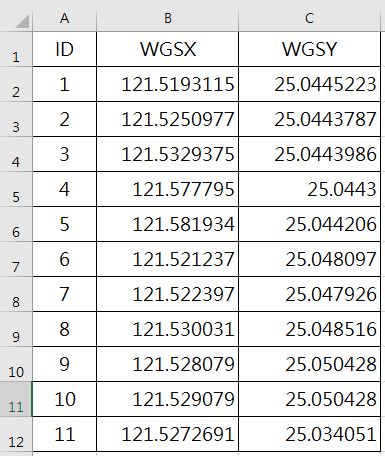
     
  
  二、將 .xls檔案加進ArcGIS，在檔案上按滑鼠右鍵**Display XY Data**。
  
  
  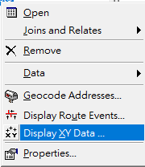
     
     
  三、**X Field**、**Y Field**分別選擇設備點位資料所自訂的X、Y座標欄位。
  
  
  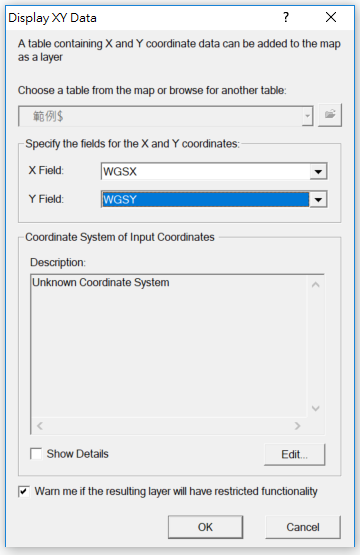
     
       
  四、按**OK**後，即於ArcGIS上完成點位定位，後續將此圖層輸出即可開始進行Link圖層對應。
    
    
  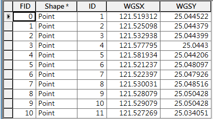
     
          
  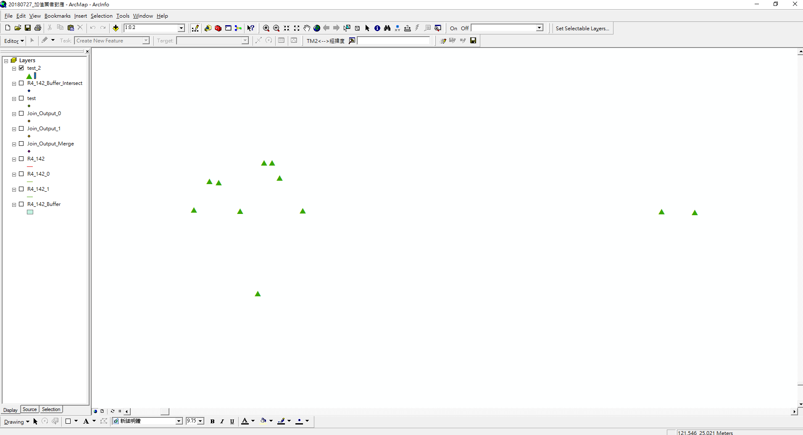
     
   
  
  

# 貳、設備點位對應Link圖層（方法一）

  一、所需圖資：設備點位圖層、Link圖層。

   * **本案例使用自行新增之點圖層及縣142 Link圖層**
   
   
   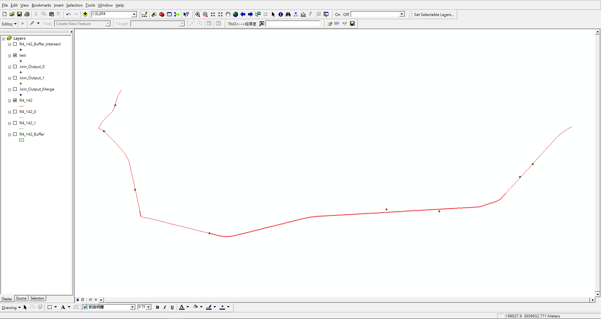
 
 
  二、將縣142 Link圖層RdDirectID欄位數值為0與1的值分別輸出。
  
  
   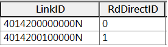
  
  
   1\. 在縣142 Link圖層上點滑鼠右鍵，選擇**Open Attribute Table**功能，開啟圖層屬性表。
   
   
   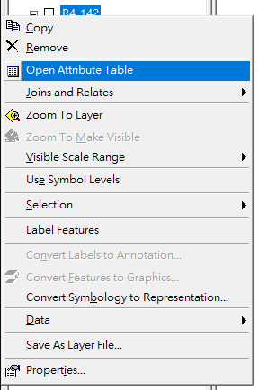
   
   
   2\. 開啟屬性表點選**Options**選單，選擇**Select By Attributes**條件式查詢功能。
   
   
   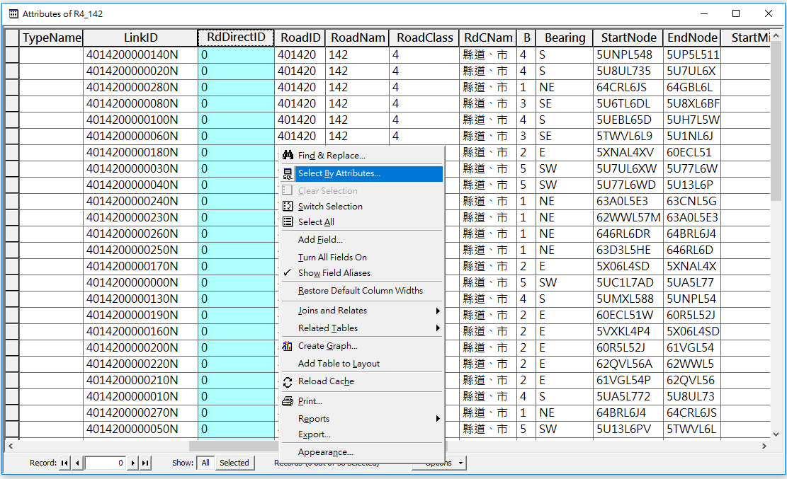
   
   
   3\. 開啟**Select By Attributes**條件式查詢後，給予RdDirectID＝0指令，並點選**Apply**。
   
   
   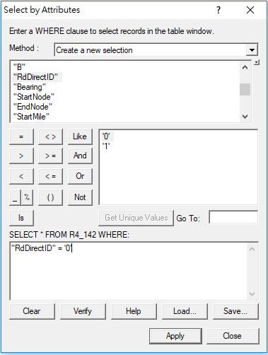
      
      
   4\. 在縣142 Link圖層上點滑鼠右鍵，選擇**Data** → **Export Data**功能，將RdDirectID＝0的資料輸出，另存新檔給予自訂檔名（如圖12、13），即可擷取出所有RdDirectID＝0的資料（如圖14）。
   
   
   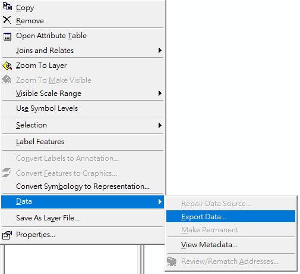
   
   
   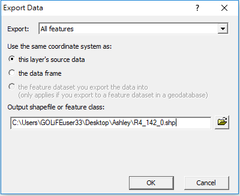
   
   
   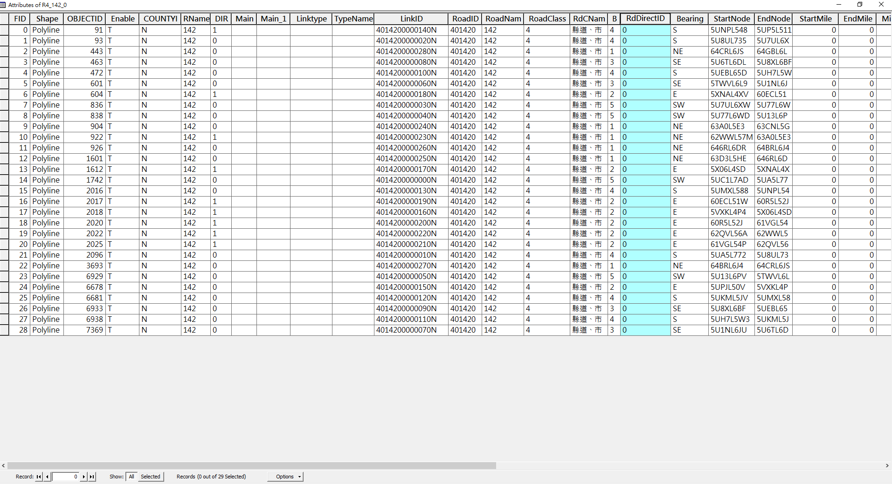
   
   
   5\. 擷取RdDirectID＝1的方式請重複3～4的步驟，差別僅在步驟3給予RdDirectID＝1指令（如圖15），即可擷取出所有RdDirectID＝1的資料（如圖16）。
   
   
   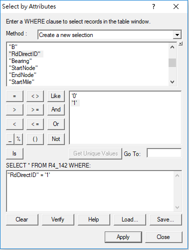
   
   
   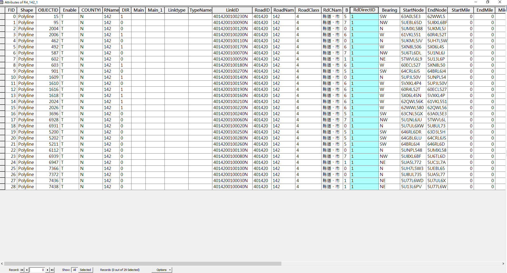
   
   
  三、將設備點位圖層與上述第二點所擷取出的圖層分別執行Join功能，即可對應到距離設備點位最近之Link。
  
   1\. 於設備點位圖層上點滑鼠右鍵，選擇**Joins and Relates** → **Join**功能。
   
   
   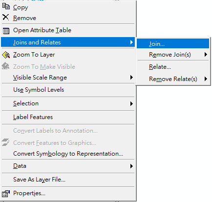
   
   
   2\.上方下拉式選單點選**Join data from another layer based on spatial location**，選項1選擇自行命名RdDirectID＝0之圖層，選項2依照圖18選擇，選項3輸入欲存檔位置及檔名。
   
   
   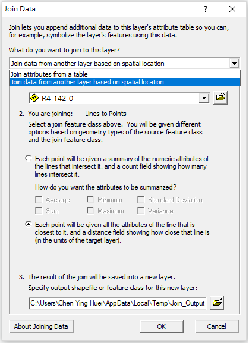
   
   
   3\. 輸入完畢按OK，即可得到設備點位圖層對應縣142 Link圖層（當RdDirectID＝0）距離最近之Link（如圖19）。
   
   
   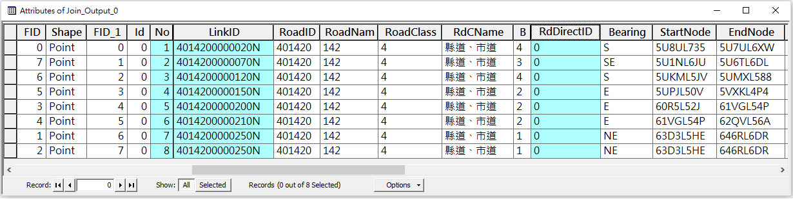 
   
   
   4\. 對應RdDirectID＝1的方式請重複步驟1～3，即可得到設備點位圖層對應縣142 Link圖層（當RdDirectID＝1）距離最近之Link（如圖20、圖21）。
   
   
   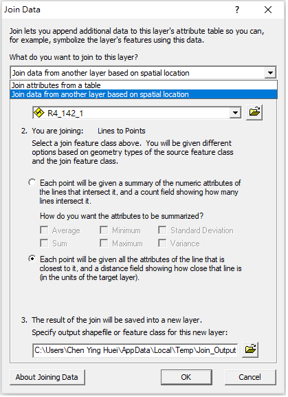 
   
  
   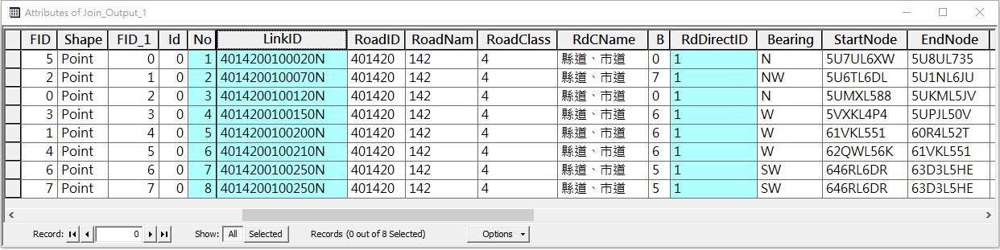 
   
   
 四、步驟三所產出圖層為獨立分開（即RdDirectID＝0、RdDirectID＝1分別為一個獨立圖層），欲將兩個獨立圖層合併為一個圖層，請繼續執行下列步驟。 
 
  1\. 開啟ArcToolbox Window工具（如圖22藍色框線）
  
  
   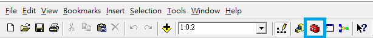
   
  
  2\. 開啟**ArcToolbox Window**，選擇**Data Management Tools** → **General** → **Merge** 功能。
  
  
   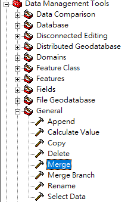
  
  
  3\. 開啟**Merge**功能，於**Input Datasets**選擇步驟三所產出圖層，**Onput Dataset**輸入欲存檔位置及檔名（如圖24），即可將兩個獨立圖層合併為一個圖層（如圖25）。
  
  
   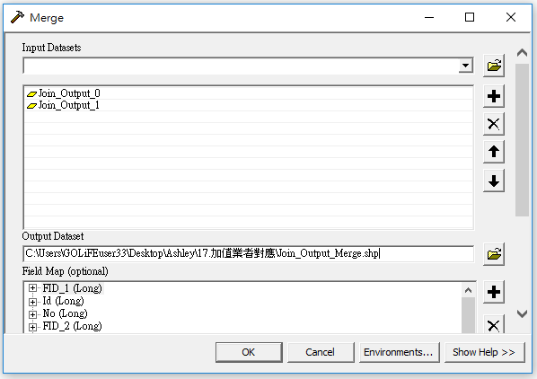
   
   
   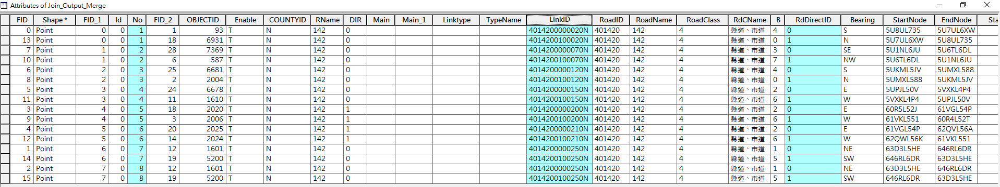
  
  
   * **注意事項：當道路非同時為單線或同時為雙線者，完成後須手動對應選擇正確方向之LinkID。**
  
  
 五、優點：可對應到唯一一條Link。
 
 六、缺點：步驟程序繁瑣。
 

# 參、設備點位對應Link圖層（方法二）

 一、所需圖資：設備點位圖層、Link圖層。
 
  * 本案例使用自行新增之點圖層及縣142 Link圖層
  
  
  
  
  
 二、利用ArcGIS Buffer功能，將線圖層轉換成面圖層進行對應。
 
  1\. 開啟**ArcToolbox Window**（如圖22），選擇**Analysis Tools** → **Proximity** → **Buffer** 功能。
  
  
  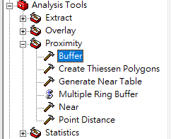
  
  
  2\. 開啟**Buffer**功能，於**Input Features**選擇縣142 Link圖層，**Onput Features Class**輸入欲存檔位置及檔名（如圖28），**Linear unit**選擇環域大小（本範例為10公尺），**End Type**選擇**Flat**功能，即可將線圖層轉換成面圖層（如圖29）。
  
  
  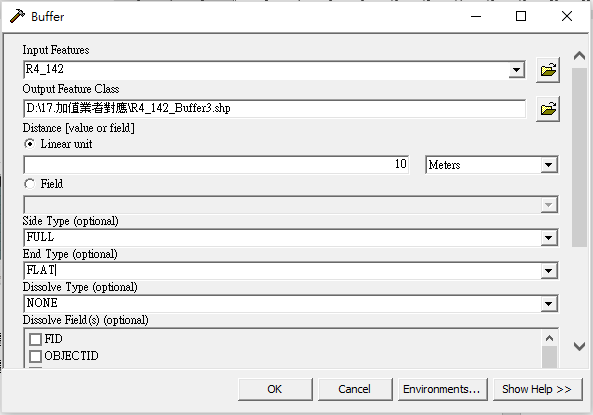
  
  
  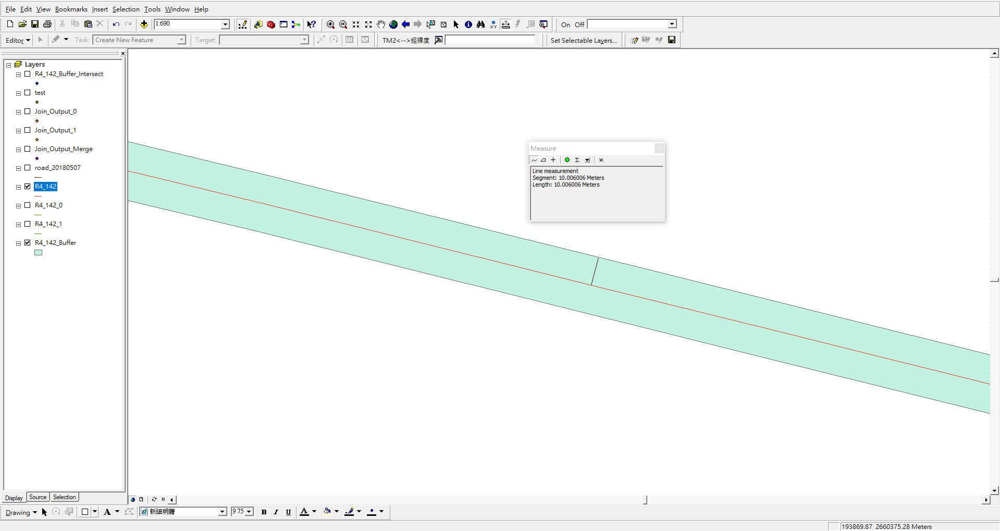
  
  
 三、利用ArcGIS Intersect功能，將設備點位與步驟二轉出之Buffer面圖層進行對應。
 
  1\. 開啟**ArcToolbox Window**（如圖22），選擇**Analysis Tools** → **Overlay** → **Intersect** 功能。
  
  
  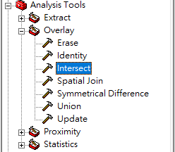
  
  
  2\. 開啟**Intersect**功能，於**Input Features**選擇步驟二轉出之Buffer面圖層及設備點位點圖層，**Onput Features Class**輸入欲存檔位置及檔名（如圖31），即可將設備點位對應至LinkID（如圖32）。
  
 
  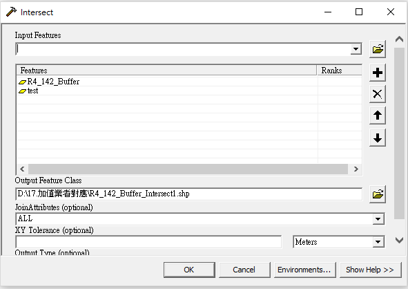
 
 
  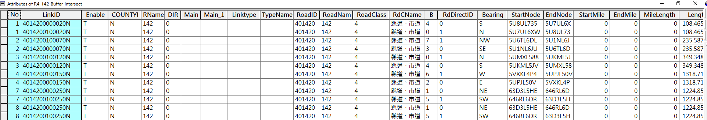
  
  
 四、優點：利用Buffer功能可以一次對應到全部Link。
 
 五、缺點：Buffer值難以設定，本範例Buffer值為10公尺，圖33點位距離最近Link在10公尺以內，因此有正確對應到Link；但圖34點位距離最近Link超過10公尺，因此無法正確對應到Link。
 
 
 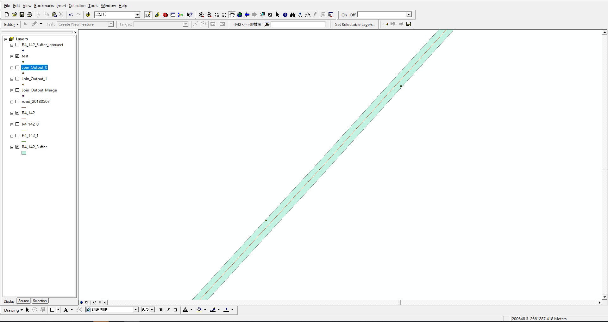
 
 
 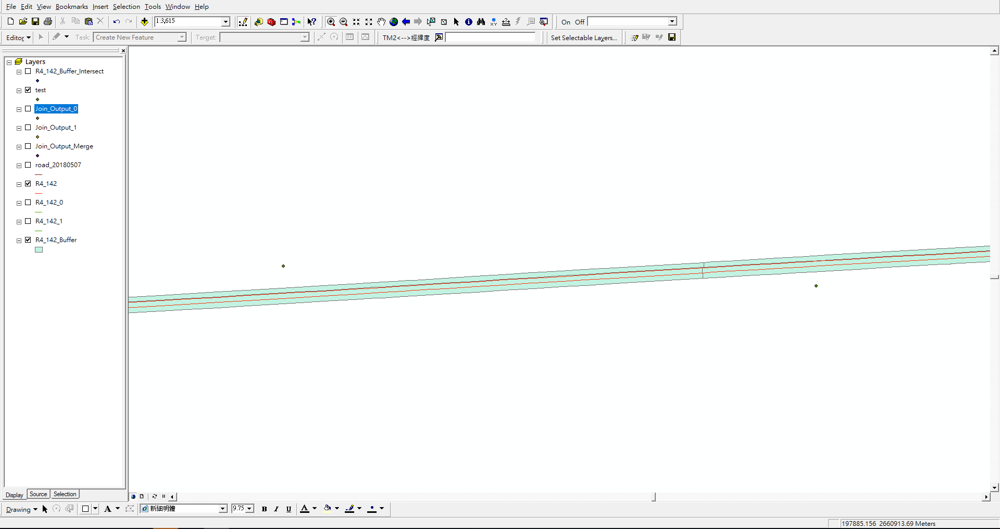
 

# 肆、自有道路圖資對應Link圖層

一、所需圖資：自有道路圖層、Link圖層。

 * **本案例使用GOLIFE道路圖層（粉色線段）及Link圖層（綠色線段），以台北市範圍為例。**
 
 
 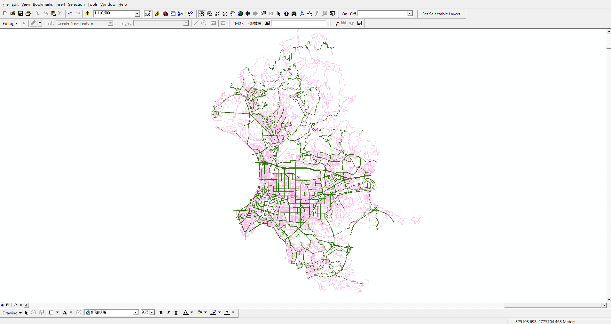
 

二、利用ArcGIS Feature To Point功能，將線圖層轉換成點圖層進行對應。

 1\. 開啟**ArcToolbox Window**（如圖22），選擇**Data Management Tools** → **Features** → **Feature To Point** 功能。
 
 
 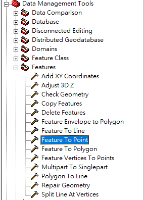
 
 
 2\. 開啟**Feature To Point**功能，於**Input Features**選擇自有道路圖層，**Onput Features Class**輸入欲存檔位置及檔名（如圖37），勾選**Inside**欄位，即可將線圖層轉換成點圖層（如圖38）。
 
 * **勾選Inside欄位可將轉換後點位準確黏貼在原有自有道路圖層上。**
 
 
 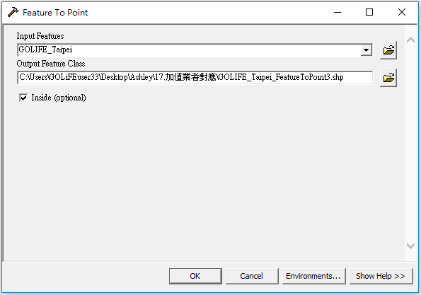
 
 
 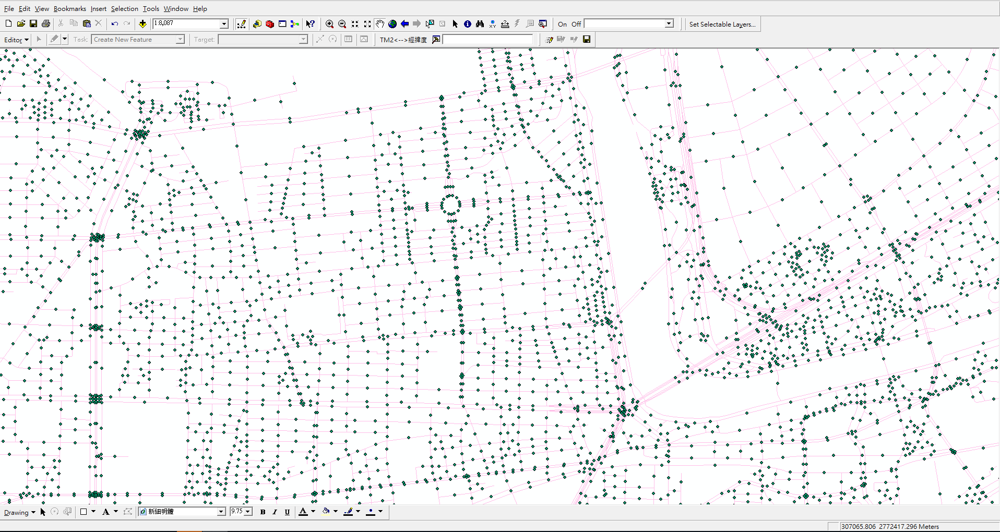
 
 
三、利用ArcGIS Buffer功能，將線圖層轉換成面圖層進行對應。

 1\. 開啟**ArcToolbox Window**（如圖22），選擇**Analysis Tools** → **Proximity** → **Buffer** 功能。
 
  
  
  
 
 2\. 開啟**Buffer**功能，於**Input Features**選擇縣Link圖層，**Onput Features Class**輸入欲存檔位置及檔名（如圖40），**Linear unit**選擇環域大小（本範例為5公尺），**End Type**選擇**Flat**功能，即可將線圖層轉換成面圖層（如圖41）。
 
 
 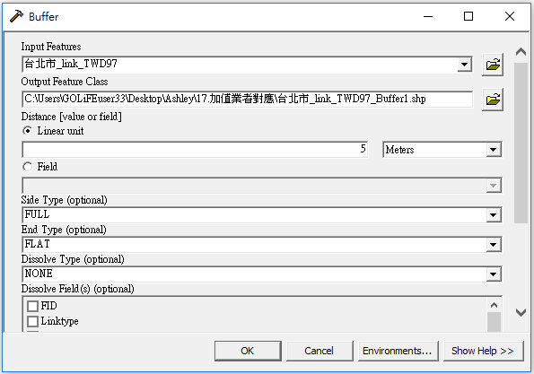
 
 
 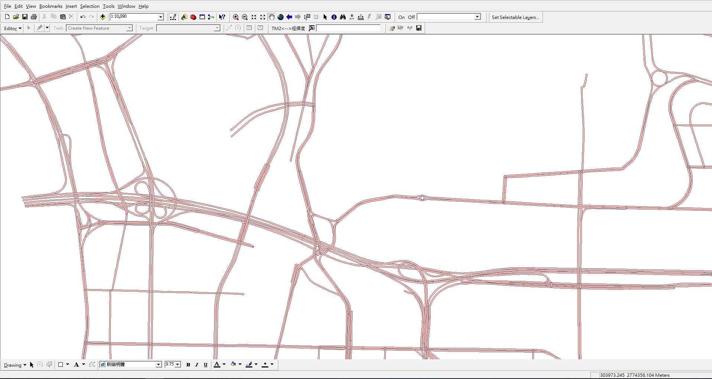
 
 
四、利用ArcGIS Intersect功能，將步驟二轉出之點圖層與步驟三轉出之Buffer面圖層進行對應。

 
 1\. 開啟**ArcToolbox Window**（如圖22），選擇**Analysis Tools** → **Overlay** → **Intersect** 功能。
 
 
  
  
  
 2\. 開啟**Intersect**功能，於**Input Features**選擇步驟二轉出之點圖層與步驟三轉出之Buffer面圖層，**Onput Features Class**輸入欲存檔位置及檔名（如圖43），即可將點圖層對應至LinkID（如圖44、45）。
 
 
  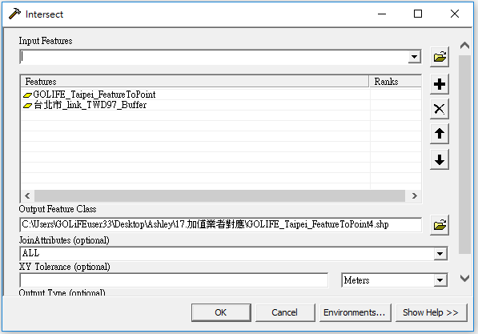
  
  
  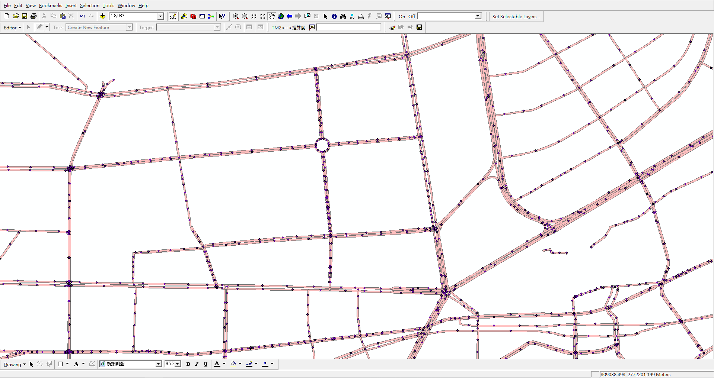
  
 
  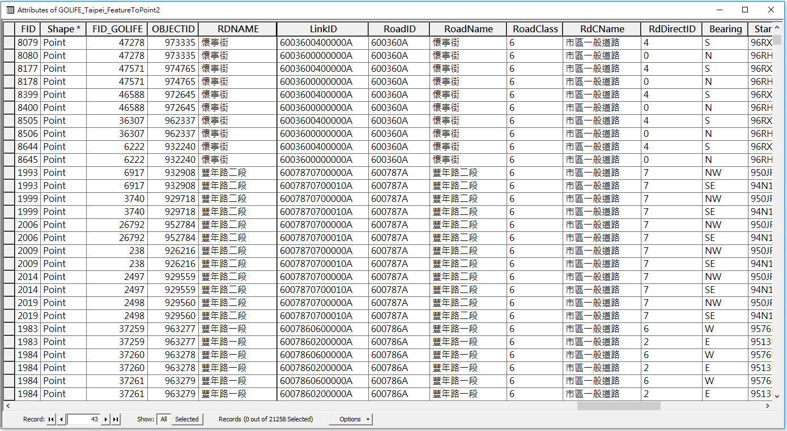
  
  
