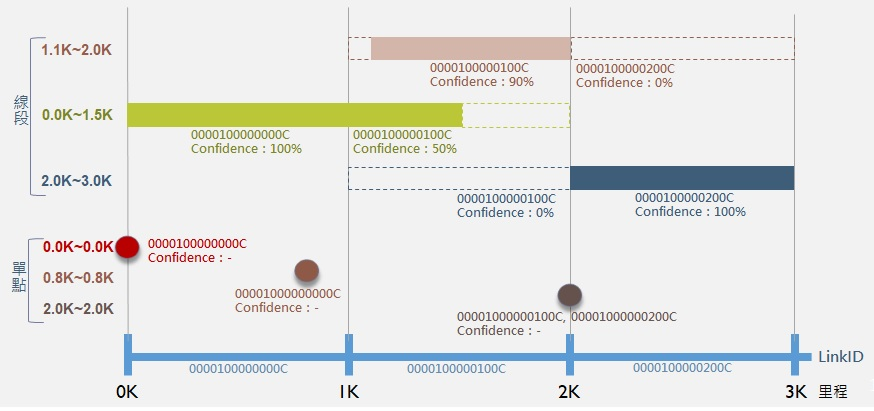

# 里程對應(國道/快速公路/一般省道)

* 功能：查詢指定里程所涵蓋之LinkID及Confidence，分段點(含邊界)亦輸出前後關聯LinkID。

* Confidence：信心水準，以起迄里程對應到各路段之涵蓋比率計算。

&emsp;&emsp;1\. 線段：對應到Link，以涵蓋LinkID之比率作為Confidence數值。

&emsp;&emsp;2\. 單點：對應到Link或Node，不另外提供Confidence數值。

