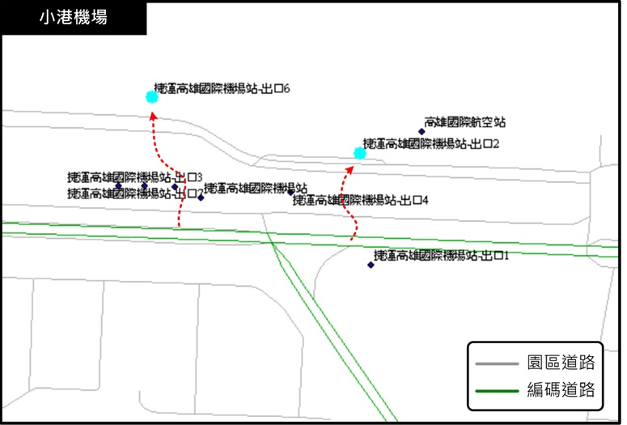
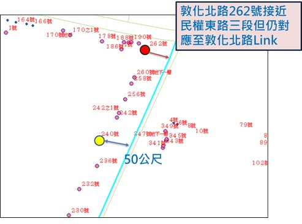
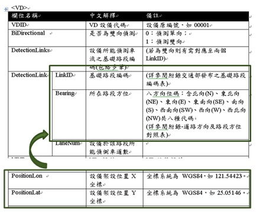

# 里程對應(國道/快速公路/一般省道)

* 功能：查詢指定里程所涵蓋之LinkID及Confidence，分段點(含邊界)亦輸出前後關聯LinkID。

* Confidence：信心水準，以起迄里程對應到各路段之涵蓋比率計算。

  * 線段：對應到Link，以涵蓋LinkID之比率作為Confidence數值。
  
  * 單點：對應到Link或Node，不另外提供Confidence數值。

# 運輸場站對應(高鐵/火車/捷運/機場)

* 本計畫進行之運輸場站範圍包括臺鐵車站、捷運車站、高鐵車站及機場。

* 對應作業原則：

  * 運輸場站各出入口皆進行對應。
  
  * 以運輸場站出入口所在位置最接近之路段並同時以其所在側向、車行方向進行判斷。
  
  * 若出入口所在非屬編碼範圍路段, 則於200公尺內對應至鄰近之編碼道路，但若於200公尺外則進一步考量、評估編碼擴充需求。

# 門牌地址對應

* 依據內政部戶政司門牌資料進行對應。

* 因道路編碼具有方向性，道路為雙向編碼，為確保對應之正確性，門牌對應時會參考路名及方向進行判斷。

* 篩選條件：

  * 與Link距離50公尺範圍內之門牌。
  
  * 門牌之路名以○○路結尾者。

* 對應作業原則：

  * 對應完成之門牌路名需與Link之道路名稱相同。
  
  * 位於轉角之門牌，擴大門牌對應buffer(50公尺)，對應結果正確性與上點相同。
  
  * 門牌對應之LinkID，加入方向性判斷。

# 路側設施對應

* 配合交通部「即時路況資料標準2.0」，本系統提供LinkID導入工具由實務單位自行選取對應，建立設備與路段編碼相對應之數據資料，當實務單位建立完成後，可自行將之轉為靜態XML。

