# 方位碼導入

* 僅供道路方位碼導入使用，輸出資料(不)包含LinkID相關欄位。

* 用於交通資訊涵蓋主要道路及街、巷、弄的資料(如：站牌、停車場等)標示使用。

## 資料準備

* .CSV檔案

* 欄位名稱不限定

* 需包含**經度**、**緯度**坐標欄位

## 成果預覽

* .CSV檔案

* 導入Bearing、RoadNam等欄位資料

## 操作說明

&emsp;&emsp;1. 點擊「選擇檔案」

&emsp;&emsp;2. 選擇自有檔案(支援 .csv 格式)

&emsp;&emsp;3. 選擇「單路段選取工具」

&emsp;&emsp;4. 點擊「下一步」

&emsp;&emsp;5. 選擇「方位導入」圖層 (含街、巷、弄資料)

&emsp;&emsp;6. 設定自有資料**經度**、**緯度**欄位

&emsp;&emsp;* 自有資料檔案匯入後，圖臺之相關配置說明

&emsp;&emsp;7. 依照資料清單逐筆點選欲對應之路段 (依照資料所在道路側向，選擇正確對應之方位碼)

&emsp;&emsp;8. 編輯下一筆或完成資料選取

&emsp;&emsp;* 已編輯資料用其他顏色標示

&emsp;&emsp;* 圖臺 ⇄ 表單操作連動

&emsp;&emsp;9. 編輯完成後將「檔案匯出」，即完成Bearing (方位碼)相關欄位導入。

# 單一路段編碼導入

* 供單一路段編碼導入使用，輸出資料包含LinkID相關欄位。

* 用於位置於國、省道、省快、市快、縣道、市區主要道路資料 (如：VD、停車格位…) 標示使用。

## 資料準備

* .CSV檔案

* 欄位名稱不限定

* 需包含**經度**、**緯度**坐標欄位

## 成果預覽

* .CSV檔案

* 導入Bearing、LinkID、RoadID、RoadName、RoadDirection…等欄位資料

## 操作說明

&emsp;&emsp;1. 點擊「選擇檔案」

&emsp;&emsp;2. 選擇自有檔案(支援 .csv 格式)

&emsp;&emsp;3. 選擇「單路段選取工具」

&emsp;&emsp;4. 點擊「下一步」

&emsp;&emsp;5. 選擇「路段編碼」圖層 (含街、巷、弄資料)

&emsp;&emsp;6. 設定自有資料**經度**、**緯度**欄位

&emsp;&emsp;* 自有資料檔案匯入後，圖臺之相關配置說明
   
 

&emsp;&emsp;7. 點選欲對應之路段(可由方位、方向輔助判斷位置是否正確)

&emsp;&emsp;8. 編輯下一筆或完成資料選取

&emsp;&emsp;* 請依「方位碼」資料選取 資料 正確之路段方位

&emsp;&emsp;* 已編輯資料用其他顏色標示

&emsp;&emsp;* 圖臺 ⇄ 表單操作連動

&emsp;&emsp;9. 編輯完成後將「檔案匯出」，即完成LinkID (路段編碼)相關欄位導入。

# 連續路段編碼導入 (已知起迄點)

* 供連續路段編碼導入使用，輸出資料包含LinkID相關欄位

* 用於選取多路段(路徑)資料(如：eTag配對路徑選取) 標示使用。

## 資料準備

* .CSV檔案

* 欄位名稱不限定

* 需包含**經度**、**緯度**坐標欄位

## 成果預覽

* .CSV檔案

* 導入Bearing、LinkID、RoadID、RoadName、RoadDirection…等欄位資料

## 操作說明

&emsp;&emsp;1. 點擊「選擇檔案」

&emsp;&emsp;2. 選擇自有檔案(支援 .csv 格式)

&emsp;&emsp;3. 選擇「單路段選取工具」

&emsp;&emsp;4. 點擊「下一步」

&emsp;&emsp;5. 設定自有資料經度、緯度

   * 自有資料檔案匯入後，圖臺之相關配置說明
   
 

&emsp;&emsp;6. 在圖台點選欲對應之路段，選擇正確對應之路段編碼 (可由方位、方向輔助判斷位置是否正確)

&emsp;&emsp;7. 點擊「繼續選取」繼續選擇路段，或點選「下一筆 | 完成」結束該筆資料編輯

   * 不連續資料點選時將彈跳錯誤視窗
   

&emsp;&emsp;8. 編輯完成後將「檔案匯出」，即完成LinkID (路段編碼)相關欄位導入

# 連續路段編碼導入 (起迄點未知)

* 供連續路段編碼導入使用，輸出資料包含LinkID相關欄位。

* 用於選取多路段(路徑)資料(如：eTag 配對路徑選取) 標示使用。

## 資料準備

* .CSV檔案

* 欄位名稱不限定

## 成果預覽

* .CSV檔案

* 導入Bearing、LinkID、RoadID、RoadName、RoadDirection…等欄位資料

## 操作說明

&emsp;&emsp;1. 點擊「選擇檔案」

&emsp;&emsp;2. 選擇自有檔案(支援 .csv 格式)

&emsp;&emsp;3. 選擇「多路段選取工具(不設定起始資訊) 」

&emsp;&emsp;4. 點擊「下一步」

   * 自有資料檔案匯入後，圖臺之相關配置說明
   
 

&emsp;&emsp;5. 在圖台點選欲對應之路段，選擇正確對應之路段編碼 (可由方位、方向輔助判斷位置是否正確)

&emsp;&emsp;6. 點擊「繼續選取」繼續選擇路段，或點選「下一筆 | 完成」結束該筆資料編輯

   * 不連續資料點選時將彈跳錯誤視窗
   

&emsp;&emsp;7. 編輯完成後將「檔案匯出」，即完成LinkID (路段編碼)相關欄位導入。

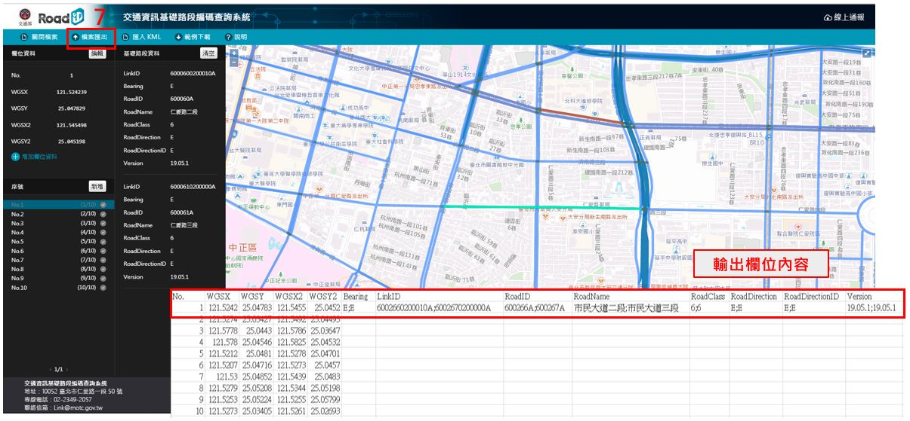

# 其他功能說明

* 說明其他應用功能：資料清除、欄位編輯、欄位新增、資料新增、匯出過濾、範圍設定。

## 坐標移動

* 當導入之坐標錯誤時使用，使用步驟如下：

&emsp;&emsp;1. 點選欲移動之資料

&emsp;&emsp;2. 按住Ctrl+滑鼠左鍵並拖曳至指定位置

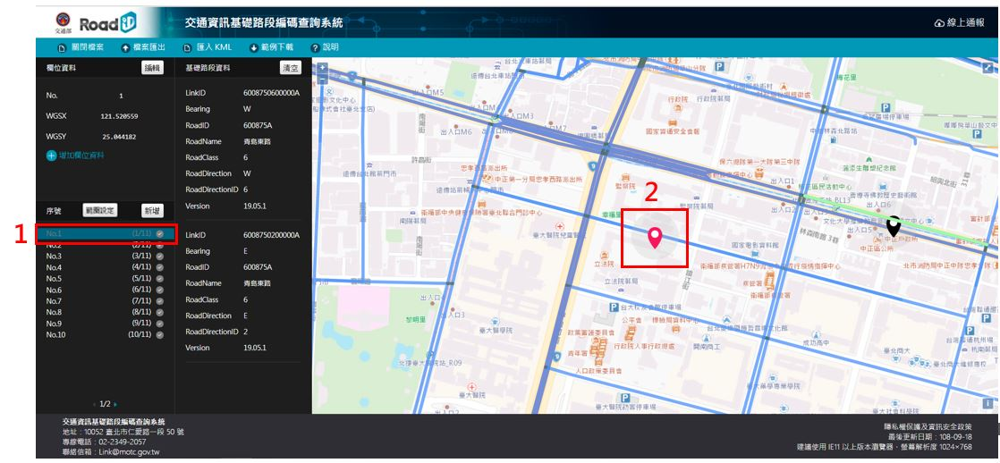

## 取消重選

* 當導入之資料錯誤時使用，使用步驟如下：

&emsp;&emsp;1. 點選錯誤導入之藍底資料 (點選後資料將即清除)

&emsp;&emsp;2. 選擇「繼續選取」或「下一筆 | 完成」

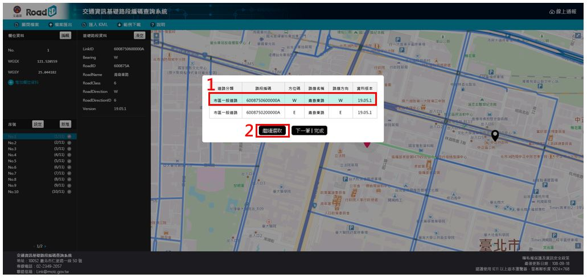

## 資料清除

* 當導入之資料錯誤時使用，使用步驟如下：

&emsp;&emsp;1. 點選左下方指定資料

&emsp;&emsp;2. 選擇「清空」 (點選後資料將即刻清除)

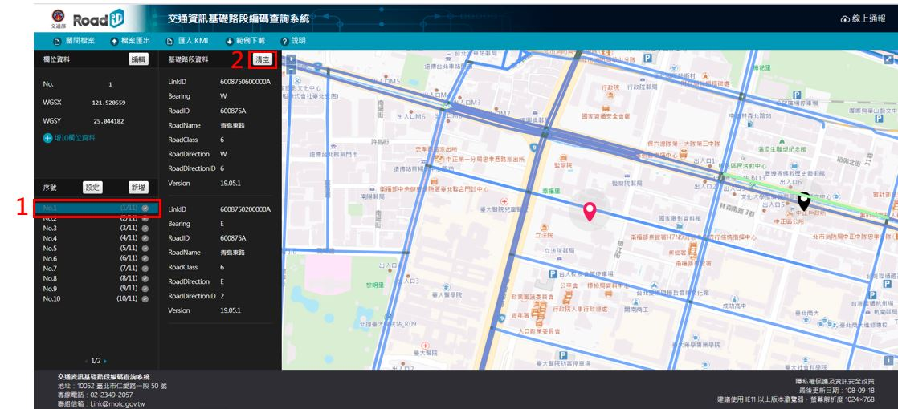

## 欄位編輯

* 當需於線上修改欄位內容時使用，使用步驟如下：

&emsp;&emsp;1. 點選「編輯」

&emsp;&emsp;2. 編輯欄位內容

&emsp;&emsp;3. 點擊「確定」，完成編輯

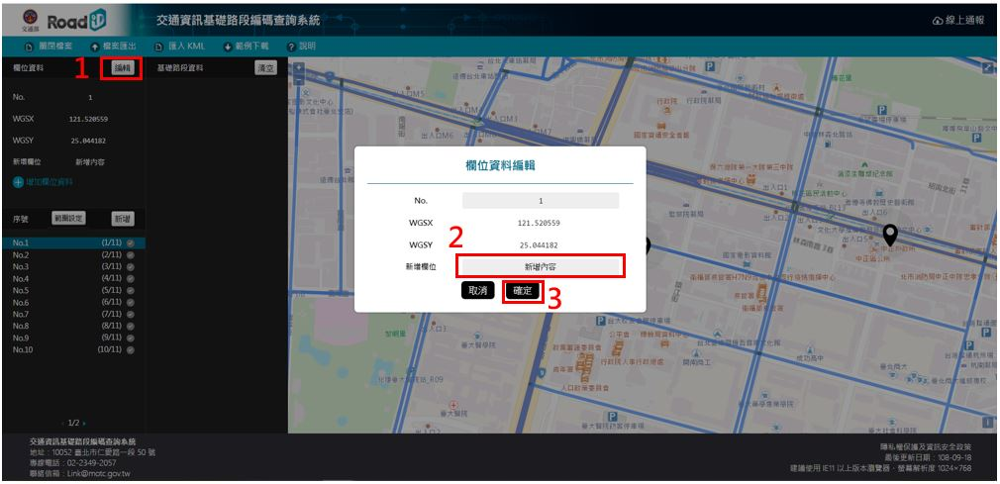

## 欄位新增

* 當需於線上增加欄位時使用，使用步驟如下：

&emsp;&emsp;1. 點選「增加欄位資料」

&emsp;&emsp;2. 編輯欄位名稱、內容

&emsp;&emsp;3. 點擊「確定」，完成編輯

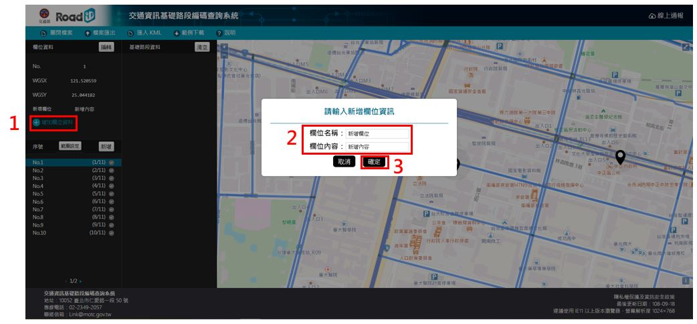

## 資料新增

* 當需於線上增加資料筆數時使用，使用步驟如下：

&emsp;&emsp;1. 點選「新增」

&emsp;&emsp;2. 輸入經度、緯度

&emsp;&emsp;3. 點擊「確定」，完成編輯

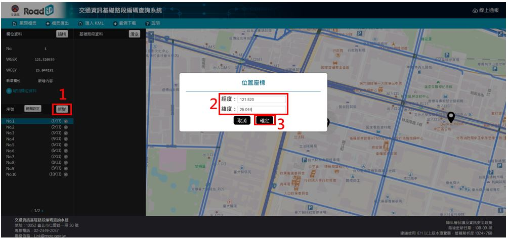

## 匯出過濾

* 當需於線上整理匯出資料時使用，使用步驟如下：

&emsp;&emsp;1. 點選(v)

&emsp;&emsp;2. 「確定」，原 (v) 變為 (x)

&emsp;&emsp;3. 匯出的資料將不包含該筆資料 (如需復原則需點擊 (x))

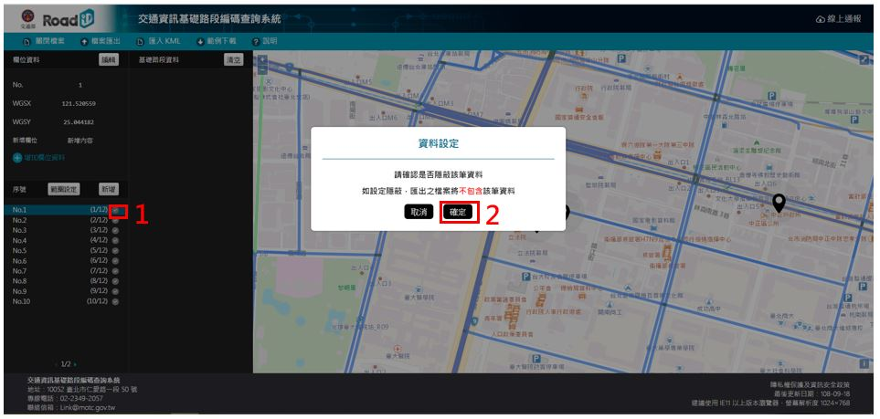

## 範圍設定 (限定單路段工具使用)

* 當需修改路段選取限制範圍時使用，使用步驟如下：

&emsp;&emsp;1. 點選「範圍設定」

&emsp;&emsp;2. 輸入限制範圍

&emsp;&emsp;3. 點擊「確定」，完成變更

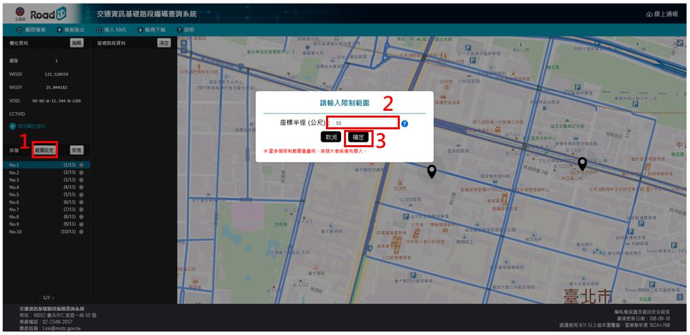

## 需要導入多個路段，怎麼辦? 

* 本工具提供導入多個路段功能，使用步驟如下：

&emsp;&emsp;1. 選中第一個路段

&emsp;&emsp;2. 點擊「繼續選取」

&emsp;&emsp;3. 選中第二個路段

&emsp;&emsp;4. 點擊「下一筆 | 完成」

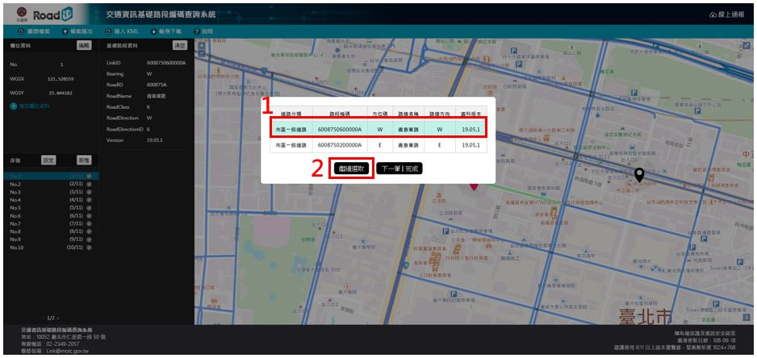

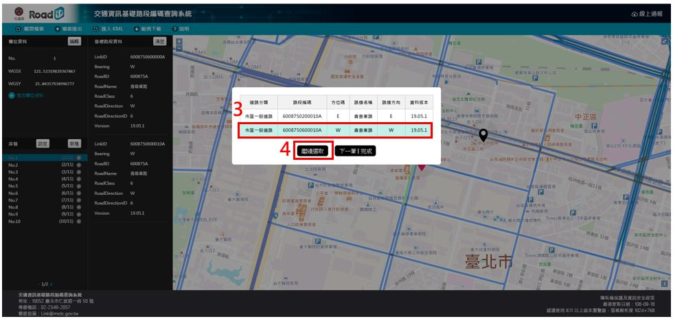

## 上傳的CSV檔，顯示為亂碼，怎麼辦? 

* 本工具所提供之資料編碼格式為 UTF-8。若使用 Microsoft EXCEL軟體開啟CSV檔案時，會出現中文無法正確顯示，其因為EXCEL軟體預設檔案編碼設定為ANSI 編碼，故會出現亂碼情況。若您嘗試使用EXCEL 軟體開啟CSV檔案請參閱下列方法解決CSV開啟為亂碼的問題。

&emsp;&emsp;1. 將欲上傳的CSV檔案，點選滑鼠右鍵，開啟檔案以記事本開啟。

&emsp;&emsp;2. 開啟檔案後，點選檔案，另存新檔，並將編碼格式選為UTF-8。

# WKT&emsp;&emsp;資料取得說明

* 說明對應完成後的路段編碼之路徑 (WKT) 資料如何取得

* 利用Excel開啟完成編輯之資料

* 於LinkID欄位最前方加入[“

* 在LinkID欄位最後方加入“]

* 利用取代功能，將 ”;” 替換成 ”,”

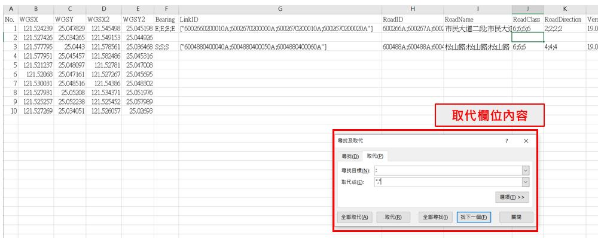

* 至API頁面 (https://link.motc.gov.tw/swagger/ui/index)

* 找到指定API：v2/Road/Link/Shape/Geometry/WKT

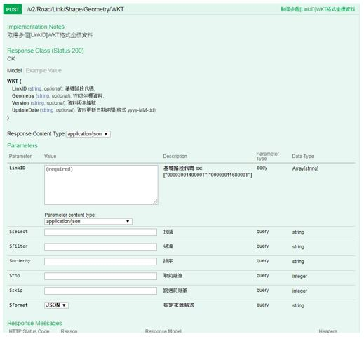

* 於LinkID欄位貼入稍早整理的資料

* 點擊Try it out!

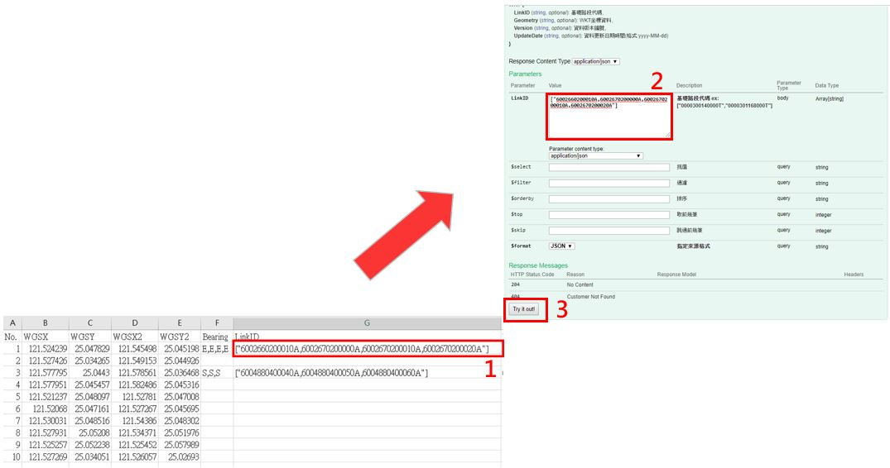

* 複製Response Body輸出資料

* 完成該筆WKT軌跡資料取得

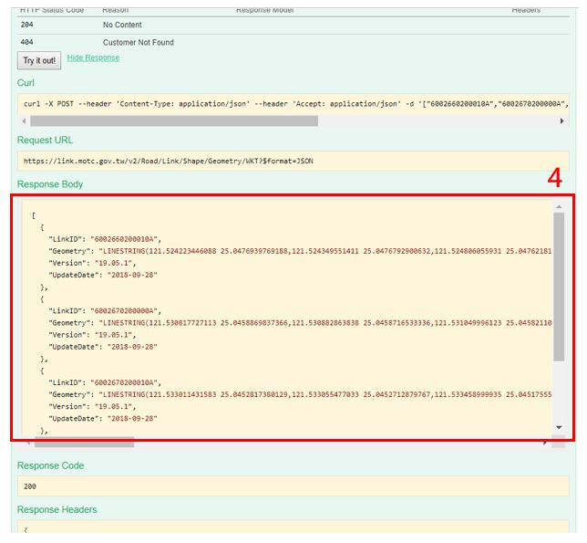

