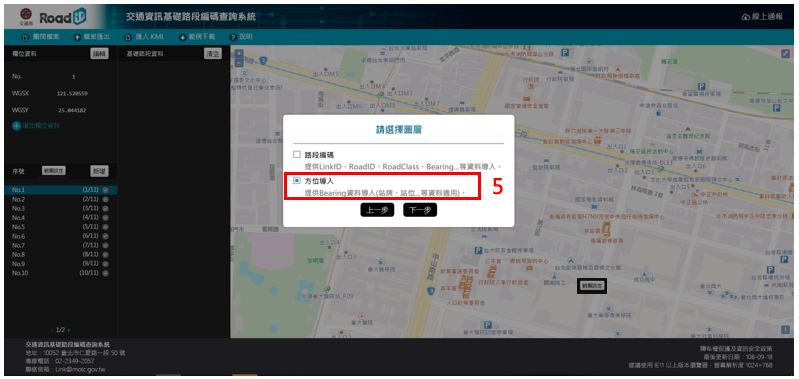

# 方位碼導入

* 僅供道路方位碼導入使用，輸出資料(不)包含LinkID相關欄位。

* 用於交通資訊涵蓋主要道路及街、巷、弄的資料(如：站牌、停車場等)標示使用。

## 資料準備

* .CSV檔案

* 欄位名稱不限定

* 需包含**經度**、**緯度**坐標欄位

## 成果預覽

* .CSV檔案

* 導入Bearing、RoadNam等欄位資料

## 操作說明

&emsp;&emsp;1. 點擊「選擇檔案」

&emsp;&emsp;2. 選擇自有檔案(支援 .csv 格式)

&emsp;&emsp;3. 選擇「單路段選取工具」

&emsp;&emsp;4. 點擊「下一步」

&emsp;&emsp;5. 選擇「方位導入」圖層 (含街、巷、弄資料)

&emsp;&emsp;6. 設定自有資料**經度**、**緯度**欄位

&emsp;&emsp;* 自有資料檔案匯入後，圖臺之相關配置說明

&emsp;&emsp;7. 依照資料清單逐筆點選欲對應之路段 (依照資料所在道路側向，選擇正確對應之方位碼)

&emsp;&emsp;8. 編輯下一筆或完成資料選取

&emsp;&emsp;* 已編輯資料用其他顏色標示

&emsp;&emsp;* 圖臺 ⇄ 表單操作連動

&emsp;&emsp;9. 編輯完成後將「檔案匯出」，即完成Bearing (方位碼)相關欄位導入。

# 單一路段編碼導入

* 供單一路段編碼導入使用，輸出資料包含LinkID相關欄位。

* 用於位置於國、省道、省快、市快、縣道、市區主要道路資料 (如：VD、停車格位…) 標示使用。

## 資料準備

* .CSV檔案

* 欄位名稱不限定

* 需包含**經度**、**緯度**坐標欄位

## 成果預覽

* .CSV檔案

* 導入Bearing、LinkID、RoadID、RoadName、RoadDirection…等欄位資料

## 操作說明

&emsp;&emsp;1. 點擊「選擇檔案」

&emsp;&emsp;2. 選擇自有檔案(支援 .csv 格式)

&emsp;&emsp;3. 選擇「單路段選取工具」

&emsp;&emsp;4. 點擊「下一步」

&emsp;&emsp;5. 選擇「路段編碼」圖層 (含街、巷、弄資料)

&emsp;&emsp;6. 設定自有資料**經度**、**緯度**欄位

&emsp;&emsp;* 自有資料檔案匯入後，圖臺之相關配置說明
   
 

&emsp;&emsp;7. 點選欲對應之路段(可由方位、方向輔助判斷位置是否正確)

&emsp;&emsp;8. 編輯下一筆或完成資料選取

&emsp;&emsp;* 請依「方位碼」資料選取 資料 正確之路段方位

&emsp;&emsp;* 已編輯資料用其他顏色標示

&emsp;&emsp;* 圖臺 ⇄ 表單操作連動

&emsp;&emsp;9. 編輯完成後將「檔案匯出」，即完成LinkID (路段編碼)相關欄位導入。

# 連續路段編碼導入 (已知起迄點)

* 供連續路段編碼導入使用，輸出資料包含LinkID相關欄位

* 用於選取多路段(路徑)資料(如：eTag配對路徑選取) 標示使用。

## 資料準備

* .CSV檔案

* 欄位名稱不限定

* 需包含**經度**、**緯度**坐標欄位

## 成果預覽

* .CSV檔案

* 導入Bearing、LinkID、RoadID、RoadName、RoadDirection…等欄位資料

## 操作說明

&emsp;&emsp;1. 點擊「選擇檔案」

&emsp;&emsp;2. 選擇自有檔案(支援 .csv 格式)

&emsp;&emsp;3. 選擇「單路段選取工具」

&emsp;&emsp;4. 點擊「下一步」

&emsp;&emsp;5. 設定自有資料經度、緯度

   * 自有資料檔案匯入後，圖臺之相關配置說明
   
 

&emsp;&emsp;6. 在圖台點選欲對應之路段，選擇正確對應之路段編碼 (可由方位、方向輔助判斷位置是否正確)

&emsp;&emsp;7. 點擊「繼續選取」繼續選擇路段，或點選「下一筆 | 完成」結束該筆資料編輯

   * 不連續資料點選時將彈跳錯誤視窗
   

&emsp;&emsp;8. 編輯完成後將「檔案匯出」，即完成LinkID (路段編碼)相關欄位導入

# 連續路段編碼導入 (起迄點未知)

* 供連續路段編碼導入使用，輸出資料包含LinkID相關欄位。

* 用於選取多路段(路徑)資料(如：eTag 配對路徑選取) 標示使用。

## 資料準備

* .CSV檔案

* 欄位名稱不限定

## 成果預覽

* .CSV檔案

* 導入Bearing、LinkID、RoadID、RoadName、RoadDirection…等欄位資料

## 操作說明

&emsp;&emsp;1. 點擊「選擇檔案」

&emsp;&emsp;2. 選擇自有檔案(支援 .csv 格式)

&emsp;&emsp;3. 選擇「多路段選取工具(不設定起始資訊) 」

&emsp;&emsp;4. 點擊「下一步」

   * 自有資料檔案匯入後，圖臺之相關配置說明
   
 

&emsp;&emsp;5. 在圖台點選欲對應之路段，選擇正確對應之路段編碼 (可由方位、方向輔助判斷位置是否正確)

&emsp;&emsp;6. 點擊「繼續選取」繼續選擇路段，或點選「下一筆 | 完成」結束該筆資料編輯

   * 不連續資料點選時將彈跳錯誤視窗
   

# 其他功能說明

# WKT資料取得說明
