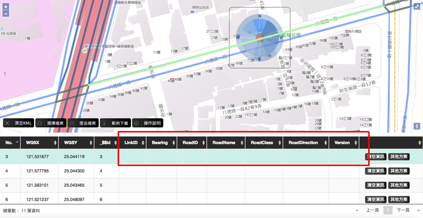

# 工具與範例檔說明

## 工具說明

* 本專案為引導使用者將路段編碼導入本身系統中，共開發方位角工具、路段選擇工具、多路段選取工具，共以上三項。

* 工具適用時機：

  * 方位角工具：供僅需導入設備方位角位置之設備使用，如公車站牌…等。
 
  * 單路段選擇工具：供僅需導入路段方位角、LinkID、RoadID…等資料設備使用，如VD、CCTV…等。
 
  * 多路段選取工具：供需導入路徑(連續路段)之方位角、LinkID、RoadID…等資料設備使用，如ETC…等。

* 輸入/輸出欄位：

  * 輸入欄位：起(訖)點經度、起(訖)點緯度坐標。
  
  * 方位角工具-輸出欄位：Bearing。
  
  * 單路段選擇工具-輸出欄位：Bearing、LinkID、RoadID、RoadName、RoadClass、RoadDirection。
  
  * 多路段選取工具-輸出欄位：Bearing、LinkID、RoadID、RoadName、RoadClass、RoadDirection。
  
## 範例檔說明

* 本工具已提供範例檔於網頁中，至 http://link.motc.gov.tw/Direction 網址中選擇範例下載即可取得範例檔。

* 範例檔案使用說明：

  * 範例檔中WGSX, WGSX2 為經度欄位， WGSY, WGSY2為緯度欄位。檔案匯入後請選擇指定經緯度欄位並點擊確認開始下一步。
  
  * 本工具可接受的上傳檔案格式為.csv，編碼格式為UTF-8，您可以透過「選擇檔案」匯入自有資料。為正確定位設備坐標，您匯入檔案務必具有經度、緯度欄位，且坐標格式須為WGS84。

# 檔案亂碼說明

## 上傳的CSV檔，顯示為亂碼，怎麼辦？

* 本工具所提供之資料編碼格式為UTF-8。若使用Microsoft EXCEL軟體開啟CSV檔案時，會出現中文無法正確顯示，其因為EXCEL軟體預設檔案編碼設定為ANSI編碼，故會出現亂碼情況。若您嘗試使用EXCEL軟體開啟CSV檔案請參閱下列方法解決CSV開啟為亂碼的問題。

* 操作說明：

&emsp;&emsp;1. 將欲上傳的CSV檔案，點選滑鼠右鍵，開啟檔案以記事本開啟。

&emsp;&emsp;2. 開啟檔案後，點選檔案，另存新檔，並將編碼格式選為UTF-8。

## 下載的CSV檔，顯示為亂碼，怎麼辦？

* 本工具所提供之資料編碼格式為UTF-8。若使用Microsoft EXCEL軟體開啟CSV檔案時，會出現中文無法正確顯示，其因為EXCEL軟體預設檔案編碼設定為ANSI編碼，故會出現亂碼情況。若您嘗試使用EXCEL軟體開啟CSV檔案請參閱下列方法解決CSV開啟為亂碼的問題。

* 操作說明：

&emsp;&emsp;1. 將下載的CSV檔案，點選滑鼠右鍵，開啟檔案以記事本開啟。

&emsp;&emsp;2. 開啟檔案後，點選檔案，另存新檔，並將編碼格式選為ANSI。

&emsp;&emsp;3. 使用EXCEL開啟檔案。

# 方位角工具說明

## 方位角工具

* 說明：方位角工具，供不需引用路段編碼的機關，或者其設施/設備地點不具有路段編碼的加值業者或交通機關所使用。

* 工具特性：

  * 使用者可藉由匯入檔案的坐標導至指定設備位置。

  * 使用者可藉由點擊圖像導入方位角。

  * 如有坐標錯誤時可於頁面內修改。

  * 可引入多個方位角。

## 方位角工具 初始畫面

* 點擊操作說明後可取得說明文件。

* 點擊範例下載後可取得檔案範本。

* 點擊選擇檔案後可進行檔案匯入。

## 方位角工具 選擇檔案

* 點擊選擇檔案後即可將欲編輯的檔案上傳，上傳之檔案資料欄位至少須具備設備坐標位置(格式：WGS84)。

## 方位角工具 工具選擇

* 完成工具選擇後，需選擇上傳資料的經緯度欄位名稱。(以範例檔為例：經度：WGSX、緯度：WGSY)

* 點擊確定，即可開始進行選擇。

## 方位角工具 方位選擇(1)

* 完成坐標選擇後，即可開始選擇方位。

## 方位角工具 方位選擇(2)

* 如方位未選擇選完畢則點選「否」，即可繼續編輯該筆資料。

* 如以選擇完畢則點選「是」，則會跳至下一筆。

## 方位角工具 資料確認

* 方位選擇後可查看Bearing欄位，如正確選擇將會帶入指定值。

## 方位角工具 其他方案

* 當有需要清空已選數值或更改坐標時，可點選其他方案進行操作。

## 方位角工具 匯出檔案

* 當檔案編輯完成後可進行匯出，即可取得編輯完成之.csv檔。 

