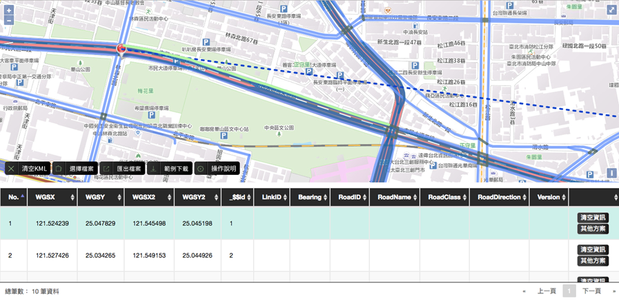
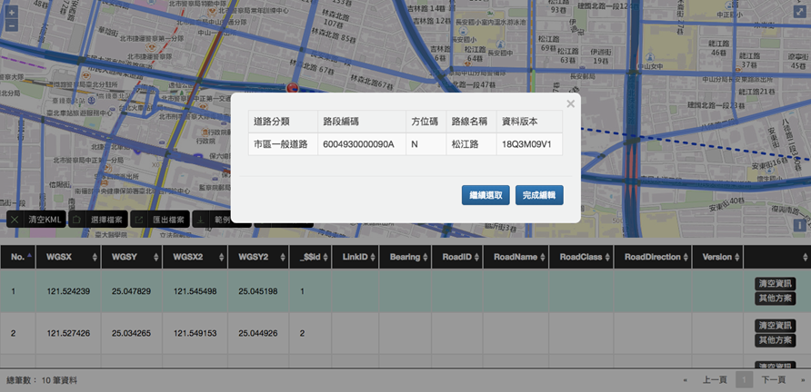
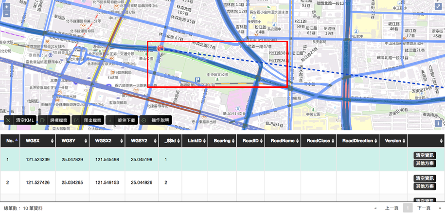
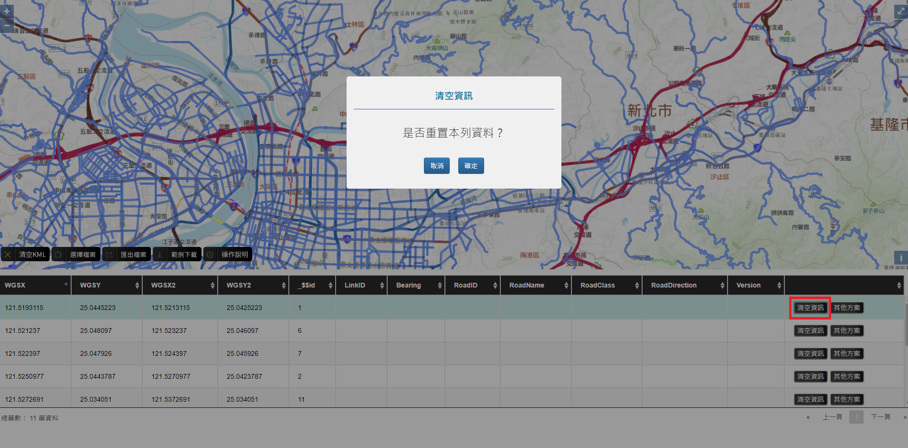
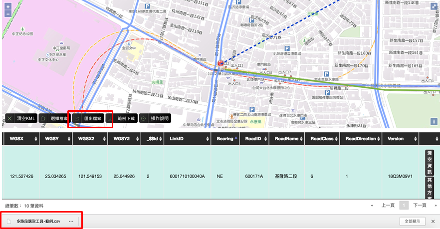
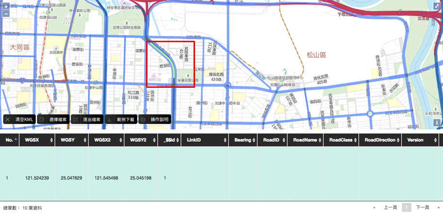

# 工具與範例檔說明

## 工具說明

* 本專案為引導使用者將路段編碼導入本身系統中，共開發方位角工具、路段選擇工具、多路段選取工具，共以上三項。

* 工具適用時機：

  * 方位角工具：供僅需導入設備方位角位置之設備使用，如公車站牌…等。
 
  * 單路段選擇工具：供僅需導入路段方位角、LinkID、RoadID…等資料設備使用，如VD、CCTV…等。
 
  * 多路段選取工具：供需導入路徑(連續路段)之方位角、LinkID、RoadID…等資料設備使用，如ETC…等。

* 輸入/輸出欄位：

  * 輸入欄位：起(訖)點經度、起(訖)點緯度坐標。
  
  * 方位角工具-輸出欄位：Bearing。
  
  * 單路段選擇工具-輸出欄位：Bearing、LinkID、RoadID、RoadName、RoadClass、RoadDirection。
  
  * 多路段選取工具-輸出欄位：Bearing、LinkID、RoadID、RoadName、RoadClass、RoadDirection。
  
## 範例檔說明

* 本工具已提供範例檔於網頁中，至 http://link.motc.gov.tw/Direction 網址中選擇範例下載即可取得範例檔。

* 範例檔案使用說明：

  * 範例檔中WGSX, WGSX2 為經度欄位， WGSY, WGSY2為緯度欄位。檔案匯入後請選擇指定經緯度欄位並點擊確認開始下一步。
  
  * 本工具可接受的上傳檔案格式為.csv，編碼格式為UTF-8，您可以透過「選擇檔案」匯入自有資料。為正確定位設備坐標，您匯入檔案務必具有經度、緯度欄位，且坐標格式須為WGS84。

# 檔案亂碼說明

## 上傳的CSV檔，顯示為亂碼，怎麼辦？

* 本工具所提供之資料編碼格式為UTF-8。若使用Microsoft EXCEL軟體開啟CSV檔案時，會出現中文無法正確顯示，其因為EXCEL軟體預設檔案編碼設定為ANSI編碼，故會出現亂碼情況。若您嘗試使用EXCEL軟體開啟CSV檔案請參閱下列方法解決CSV開啟為亂碼的問題。

* 操作說明：

&emsp;&emsp;1. 將欲上傳的CSV檔案，點選滑鼠右鍵，開啟檔案以記事本開啟。

&emsp;&emsp;2. 開啟檔案後，點選檔案，另存新檔，並將編碼格式選為UTF-8。

## 下載的CSV檔，顯示為亂碼，怎麼辦？

* 本工具所提供之資料編碼格式為UTF-8。若使用Microsoft EXCEL軟體開啟CSV檔案時，會出現中文無法正確顯示，其因為EXCEL軟體預設檔案編碼設定為ANSI編碼，故會出現亂碼情況。若您嘗試使用EXCEL軟體開啟CSV檔案請參閱下列方法解決CSV開啟為亂碼的問題。

* 操作說明：

&emsp;&emsp;1. 將下載的CSV檔案，點選滑鼠右鍵，開啟檔案以記事本開啟。

&emsp;&emsp;2. 開啟檔案後，點選檔案，另存新檔，並將編碼格式選為ANSI。

&emsp;&emsp;3. 使用EXCEL開啟檔案。

# 方位角工具說明

## 方位角工具

* 說明：方位角工具，供不需引用路段編碼的機關，或者其設施/設備地點不具有路段編碼的加值業者或交通機關所使用。

* 工具特性：

  * 使用者可藉由匯入檔案的坐標導至指定設備位置。

  * 使用者可藉由點擊圖像導入方位角。

  * 如有坐標錯誤時可於頁面內修改。

  * 可引入多個方位角。

## 初始畫面

* 點擊操作說明後可取得說明文件。

* 點擊範例下載後可取得檔案範本。

* 點擊選擇檔案後可進行檔案匯入。

## 選擇檔案

* 點擊選擇檔案後即可將欲編輯的檔案上傳，上傳之檔案資料欄位至少須具備設備坐標位置(格式：WGS84)。

## 工具選擇

* 完成匯入後可進行工具選擇，在本頁選擇方位角工具後點擊下一步。

## 選擇經緯度欄位

* 完成工具選擇後，需選擇上傳資料的經緯度欄位名稱。(以範例檔為例：經度：WGSX、緯度：WGSY)

* 點擊確定，即可開始進行選擇。

## 方位選擇(1)

* 完成坐標選擇後，即可開始選擇方位。

## 方位選擇(2)

* 如方位未選擇選完畢則點選「否」，即可繼續編輯該筆資料。

* 如以選擇完畢則點選「是」，則會跳至下一筆。

## 資料確認

* 方位選擇後可查看Bearing欄位，如正確選擇將會帶入指定值。

## 其他方案

* 當有需要清空已選數值或更改坐標時，可點選其他方案進行操作。

## 匯出檔案

* 當檔案編輯完成後可進行匯出，即可取得編輯完成之.csv檔。 

# 單路段選擇工具說明

## 路段選擇工具

* 說明：

  * 供需引用路段編碼的機關或應用廠商使用。
 
  * 使用者可藉由選擇路段而導入LinkID、RoadID與其他資料。

* 工具特性：

  * 使用者可藉由匯入檔案的坐標導至指定設備位置。

  * 使用者可藉由點擊圖面道路導入基礎路段資料。

  * 如有坐標錯誤時可於頁面內修改。
  
  * 如無可選擇路段時，可與本案通報系統聯繫。

## 初始畫面

* 點擊操作說明後可取得說明文件。

* 點擊範例下載後可取得檔案範本。

* 點擊選擇檔案後可進行檔案匯入。

## 選擇檔案

* 點擊選擇檔案後即可將欲編輯的檔案上傳，上傳之檔案資料欄位至少須具備設備坐標位置(格式：WGS84)。

## 工具選擇

* 完成匯入後可進行工具選擇，在本頁選擇單路段選取工具後點擊下一步。

## 選擇經緯度欄位

* 完成工具選擇後，需選擇上傳資料的經緯度欄位名稱。(以範例檔為例：經度：WGSX、緯度：WGSY)

* 點擊確定，即可開始進行選擇。

## 路段選擇(1)

* 完成坐標選擇後，即可開始選擇路段。

## 路段選擇(2)

* 路段選中時將以「高亮」標記。

* 如該設備之路段未選擇選完畢則點選「完成編輯」，即可繼續引入編碼。

* 如該設備之路段已選擇完畢則點選「繼續選取」，即可編輯下一筆資料。

## 資料確認

* 方位選擇後可查看 LinkID、Bearing 等欄位，如正確選擇將會帶入指定值。

## 其他方案

* 當有需要清空已選數值或更改坐標時，可點選其他方案進行操作。

## 匯出檔案

* 當檔案編輯完成後可進行匯出，即可取得編輯完成之.csv檔。

# 多路段選取工具說明

## 多路段選取工具

* 說明：

  * 多路段選取工具，供需引用路段編碼的機關或應用廠商所使用。

  * 因應道路設備對應資料時，可能有對應資料為路徑之需求(路徑係由多個連續路段所組成，可能為ㄧ般直線道路或圓環、轉彎道、與一個或多個非同級道路之路段連接組成等特殊狀況)。

* 工具特性：

  * 使用者可藉由匯入檔案的坐標導至指定設備位置。
  
  * 使用者可藉由點擊圖面道路導入基礎路段資料。

  * 如有坐標錯誤時可於頁面內修改。
  
  * 如無可選擇路段時，可與本案通報系統聯繫。

* 使用指引：

  * 匯入檔案：檔案格式為.csv，編碼格式為UTF-8，欄位至少要有兩組經緯度坐標欄位，其它自有欄位不限。

  * 提供輔助線協助使用者識別起迄方向。

  * 當坐標位置錯誤時，可直接於圖台使用左鍵Ctrl+圖標中心點拖曳進行修正。
  
    * 註：宜先完成設備對應單路段確認後再進行配對路徑選取，以保持設備所在位置與其它XML資料之一致性。
  
  * 路段選取必須確保方向之一致性及連續性，故除第一個路段外，後續只能選擇與前一路段迄點相接之路段。

  * 設施/設備資料編輯錯誤時可直接清除。

  * 匯出檔案以儲存完成工作，下次匯入檔案時可繼續未完成作業。

  * 當無可選擇路段或分段不適用時，可透過通報系統說明需求。

## 初始畫面

* 點擊操作說明後可取得說明文件。

* 點擊範例下載後可取得檔案範本。

* 點擊選擇檔案後可進行檔案匯入。

## 選擇檔案

* 點擊選擇檔案後即可將欲編輯的檔案上傳，上傳之檔案資料欄位至少須具備設備坐標位置(格式：WGS84)。

## 工具選擇

* 完成匯入後可進行工具選擇，在本頁選擇多路段選取工具後點擊下一步。

## 選擇經緯度欄位

* 完成工具選擇後，需選擇上傳資料的起訖經緯度欄位名稱。

* 以範例檔為例：(起點經度：WGSX、起點緯度：WGSY；迄點經度：WGSX2、迄點緯度：WGSY2)

* 完成後點擊確定，即可開始進行選擇。

## 路段選擇(1)

* 完成坐標選擇後，即可開始選擇路段。

* 起訖點間提供輔助線，協助使用者識別起訖方向。

## 路段選擇(2)

* 路段選中時將以「高亮」標記。

* 如該設備之路段未選擇選完畢則點選「完成編輯」，即可繼續引入編碼。

* 如該設備之路段已選擇完畢則點選「繼續選取」，即可編輯下一筆資料。

## 路段選擇(3)

* 已被選過的路段將標記顏色，藉此提醒使用者目前進度。

## 路段選擇(4)

* 本工具主要為提供路徑使用，故當選中之路段不符合篩選條件(連續路段)時，將出現提醒視窗。

## 路段選擇(5)

* 另，因圖層放大後可能有路段相疊問題，故當此情形發生時，本工具將自動篩選並顯示符合條件之路段。

## 資料確認

* 選擇後可查看 LinkID、Bearing …等欄位，如正確選擇將會帶入指定值。

## 匯入KML

* 當有需要匯入KML時，可直接拖曳檔案至地圖中。

* 如須清除已匯入之KML則請點選「清空KML」。

## 其他方案

* 當有需要清空已選數值或更改坐標時，可點選其他方案進行操作。

## 匯出檔案

* 當檔案編輯完成後可進行匯出，即可取得編輯完成之.csv檔。

