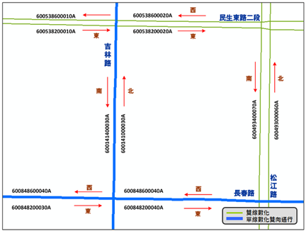

# 「即時路況資料標準2.0」內容檢視

## VD、CCTV、CMS、eTag 路側設施靜態資料

* Input

  (1)坐標
  
    * PositionLon

    * PositionLat
    
  (2)公路編號/方向/里程
  
    * 如：國道1號/順向/15.3k

* Link相關欄位

  * LinkID

  * Bearing

  * RoadDirection

  * RoadID

  * RoadName

  * RoadClass

## AVI、eTag配對路徑靜態資料

* Input

  (1)起點坐標
  
    * PositionLon1

    * PositionLat1
  
  (2)迄點坐標
  
    * PositionLon2

    * PositionLat2

* Link相關欄位

  * LinkID

  * Geometry

# 基礎路段編碼內容

## 基礎路段編碼原則

* 一般路段：

  * 分向不分道

  ＊單行道：雙向編碼，惟status：不啟用。

* 虛擬線段：

  * 不具實質意義，不編碼

## 基礎路段編碼內容

## RoadID/RoadNameID/LinkID關係

* LinkID = 基礎路段代碼
* RoadID = 道路代碼

  * 公路(含市快)：RoadClass (1碼) + RoadNameID (5碼)
  
  * 市區道路：RoadClass (1碼) + RoadNameID (5碼) + CityID (1碼)
  
# 路段編碼查詢

## 系統功能

* 路段編碼查詢：分為主題查詢與地圖查詢，適合一般使用者查詢指定路段編碼。

* API引用：主要提供程式開發者查找特定或大批資料之需求者設計。使用者可透過API查詢方式，取得所需的路段編碼結果。

* 資料下載：各式說明文件：如編碼原則、編碼規範、操作說明文件與路名表…等資料。

* 線上通報：路段未編碼、分段不符需求、其它使用問題…通報。

* LinkID導入工具：如各機關或業者需引入LinkID與設施/設備進行對應，可透過本工具進行相關作業。

## 地圖查詢

* 使用者可快速透過地圖了解目前編碼狀況，資訊內容包含道路編碼、道路分類、道路名稱、路段方位…等，且可透過圖層顯示或隱藏指定的等級道路、設備或地標種類。

## 主題查詢

* 提供使用者快速查詢特定主題的路段資訊使用，當使用者明確了解自身之需求時可透過不同選單進行快速篩選，並以圖文對照的方式產出相對應之路段編碼、道路名稱、道路分類、路段方位等資料。

# Link API 引用說明

## API -OData說明

* API採用開放式資料協定（Open Data Protocol，簡稱OData）以REST原則，允許使用者透過HTTP方式存取資料，並能根據資料的模型進而查詢與更新。

## Link API

* BasicAPI:基礎資料

  * 查詢：縣市列表、鄉鎮列表…等。

* RoadClassAPI:道路分類基礎資料

  * 查詢：道路分類列表。

* RoadNameAPI:道路(名稱)基礎資料

  * 查詢：道路(名稱)基礎資料。
  
  * 透過：道路名稱、道路分類、指定縣市與名稱等方式篩選出符合條件之資料。

* LinkAPI:路段基礎資料

  * 提供使用者查詢路段基礎資料，並可透過：道路名稱、道路分類、指定縣市與名稱等。

* GeoLocatingAPI:地理坐標定位

  * 提供使用者根據坐標位置查詢範圍內或最近距離之路段基礎資料。
  
  * 可進一步透過：指定道路分類、指定道路方向等方式篩選出符合條件之資料。

* ShapeAPI:路段線型資料

  * 提供使用者查詢路段線型軌跡坐標，提供Geojson、WKT格式資料。

## 各式基本資料

## 案例操作

* BasicAPI:基礎資料

  * 取得各縣市 「CityID」與 「CityCode」 參數。

* RoadNameAPI:道路(名稱)基礎資料

  * 取得「中正路」的道路基礎資料。

  * 取得「Road ID= 000010 (國道1號)」的所有道路基礎資料。

* LinkAPI:路段基礎資料

  * 取得「國道1號/順向」的所有路段基礎資料。
  
  * 取得「國道1號/內湖交流道-桃園交流道」的所有路段基礎資料

  * 取得「台61線/順向/20~30公里」的所有路段基礎資料。
  
  * 取得「台61線/順向/20公里處」的路段基礎資料。
  
  * 取得「台中市/中山路三段」的所有路段基礎資料。

* GeoLocatingAPI:地理坐標定位

  * 取得「坐標(121.515497, 25.076637)/範圍300公尺」內所有路段基礎資料。
  
  * 取得「坐標(121.515497, 25.076637)/最近距離」的道路路段編碼。
  
  * 取得「坐標(121.515497, 25.076637)/最近距離/北」的道路路段編碼。
  
  * 註：「坐標」位置易有定位偏誤，故僅提併單點範圍對應建議。

* ShapeAPI:路段線型資料

  * 取得「LinkID為3000220100159A/WKT」的路段線型軌跡坐標。
  
  * 註：用於路段績效展示時，請採用展示圖資線型軌跡API (未來開發)。
  
# 資料下載

## 資料下載區

* 資料下載區可隨時下載所需檔案，當資料更新時，上架日期亦將隨之更新。

# 線上通報說明

## 線上通報

* 本系統提供線上通報服務，主要針對實務運作上，可能會因為道路業管單位新增道路，或者必要原因進行編碼。當有此一情境發生時，即可利用本介面進行資訊通報。

# LinkID導入工具

## 工具說明

* 本系統為輔助使用者導入路段編碼資料，共開發方位角工具、單路段選擇工具、多路段選取工具，共以上三項。

* 方位角工具

  * 供僅需導入設備方位角位置之設備使用，如公車站牌…等。
  
  * 輸入欄位：經度、緯度坐標。
  
  * 輸出欄位：Bearing。

* 單路段選擇工具

  * 供僅需導入路段方位角、LinkID、RoadID…等資料設備使用，如VD、CCTV…等。
  
  * 輸入欄位：經度、緯度坐標。
  
  * 輸出欄位：Bearing、LinkID、RoadID、RoadName、RoadClass、RoadDirection。

* 多路段選取工具

  * 供需導入路徑(連續路段)之方位角、LinkID、RoadID…等資料設備使用，如ETC…等。
  
  * 輸入欄位：經度、緯度坐標。
  
  * 輸出欄位：Bearing、LinkID、RoadID、RoadName、RoadClass、RoadDirection。
  
## 初始畫面

* 檔案規範：

  * 檔案格式為.csv，編碼格式為UTF-8，透過「選擇檔案」匯入自有檔案。
  
  * 檔案欄位：務必具有經度、緯度欄位（含欄位名稱），且坐標格式須為WGS84，其它欄位不限
  
## 範例資料說明

* 範例資料說明：範例檔、亂碼說明文件。

* 註：自有檔案如有其他欄位亦可直接匯入本工具。

# 單路段選擇工具說明

## 單路段選擇工具

* 使用指引：

  * 匯入檔案：檔案格式為.csv，編碼格式為UTF-8，欄位至少要有一組經緯度坐標欄位，其它自有欄位不限。
  
  * 藉由匯入檔案的坐標導引至指定位置
  
  * 使用者可藉由點擊圖面線型道路導入基礎路段編碼相關資料，選取Link時可適當放大畫面俾利選取及提高定位精準度。
  
  * 當坐標位置錯誤時，可直接於圖台使用左鍵Ctrl+圖標中心點拖曳進行修正。
  
  * 單一設施/設備可根據需求引入單一或多筆路段資料。
  
  * 設施/設備資料編輯錯誤時可直接清除。
  
  * 匯出檔案以儲存完成工作，下次匯入檔案可繼續未完成作業。
  
  * 當無可選擇路段或分段不適用時，透過通報系統說明需求。
  
## 工具選擇

* 完成匯入後可進行工具選擇，在本頁選擇方位角工具後點擊下一步。

## 選擇經緯度欄位

* 完成工具選擇後，選擇上傳資料的經緯度坐標欄位名稱。(以範例檔為例：經度 ：WGSX   緯度：WGSY )

* 完成後點擊確定，即可開始進行選擇。

## 路段選擇

* 選取資料表單內設備，即可自動定位該設備所在坐標位置。

* 點選適當路段

* 依視窗內各欄位資訊，選取正確路段，選中時將以「高亮」標記。

* 如該設備之仍有路段需選擇可點選「繼續選取」，以選取其它路段。

* 如該設備之路段已選擇完畢則點選「完成編輯」，以編輯下一筆設備。

## 資料確認

* 點選正確路段後，資料表將自動引入 LinkID、Bearing 等欄位。

* 繼續下一筆：選取資料表單之下一筆設備項。

## 移動

* 設備坐標位置有誤：

  (1) 由Ctrl+左鍵拖曳圖標中心點。
  
  (2) 其它方案：略過，編輯下一筆。
  
## 清空

* 當有需要清空資料時，可點選清空資訊進行操作。

## 其他方案

* 當有需要進行通報或跳至下一筆資料繼續編輯時，可點選其他方案進行操作。

## 匯出檔案

* 可隨時匯出為*.CSV檔儲存

* 下次可匯入繼續下筆作業

## 案例操作

* 單一設備且監測單一路段。

* 單一設備且監測雙向路段。

* 設備坐標錯誤。(移動設備)

* 單一設備監測單一路段，且省市道共線。（視業管單位而定）

* 尋無需求路段，進行通報。（初期整批資料E-mail：link@motc.gov.tw）

* 編輯錯誤，整筆資料清除。

* 檔案匯出 / 檔案匯入。

# 多路段選取工具說明

## 多路段選取工具

* 使用指引：

  * 匯入檔案：檔案格式為.csv，編碼格式為UTF-8，欄位至少要有兩組經緯度坐標欄位，其它自有欄位不限。
  
  * 提供輔助線協助使用者識別起迄方向
  
  * 當坐標位置錯誤時，可直接於圖台使用左鍵Ctrl+圖標中心點拖曳進行修正。
  
    * 註：宜先完成設備對應單路段確認後再進行配對路徑選取，以保持設備所在位置與其它XML資料之一致性
    
  * 路段選取必須確保方向之一致性及連續性，故除第一個路段外，後續只能選擇與前一路段迄點相接之路段。
  
  * 設施/設備資料編輯錯誤時可直接清除。
  
  * 匯出檔案以儲存完成工作，下次匯入檔案時可繼續未完成作業。
  
  * 當無可選擇路段或分段不適用時，可透過通報系統說明需求。
  
## 工具選擇

* 完成匯入後可進行工具選擇，在本頁選擇方位角工具後點擊下一步。

## 選擇經緯度欄位

* 完成工具選擇後，需選擇上傳資料的起迄經緯度欄位名稱。

* 以範例檔為例：(起點經度：WGSX、起點緯度：WGSY ； 迄點經度：WGSX2、迄點緯度：WGSY2 )

* 完成後點擊確定，即可開始進行選擇

## 路段選擇 

* 完成坐標選擇後，即可開始選擇路段。

* 起迄點間提供輔助線，協助使用者識別起迄方向。

* 路段選中時將「高亮」標記。

* 如該設備之仍有路段需選擇可點選「繼續選取」，以選取其它路段。

* 如該設備之路段已選擇完畢則點選「完成編輯」，以編輯下一筆設備。

* 已被選過的路段將標記顏色，藉此提醒使用者目前進度。

* 本工具主要為提供路徑使用，故當選中之路段不符合篩選條件(連續路段)時，將出現提醒視窗。

## 資料確認

* 點選正確路段後，資料表將自動引入 LinkID、Bearing 等欄位。

* 繼續下一筆：選取資料表單之下一筆設備項。

## 移動

* 設備坐標位置有誤：

  (1) 由Ctrl+左鍵拖曳圖標中心點。
  
  (2) 其它方案：略過，編輯下一筆。
  
## 匯入KML

* 當有需要匯入KML時，可直接拖曳檔案至地圖中。

* 如須清除已匯入之KML則請點選「清空KML」。

## 清空

* 當有需要清空資料時，可點選清空資訊進行操作。

## 其他方案

* 當有需要進行通報或跳至下一筆資料繼續編輯時，可點選其他方案進行操作。

## 匯出檔案

* 當檔案編輯完成後可進行匯出。即可取得匯出之.CSV檔。

## 案例操作

* 編輯錯誤預防(防呆)說明

* 路徑：單一道路類別。

* 路徑：跨道路類別。

* 無此路段：進行通報。

* 編輯錯誤：整筆資料清除。

* KML匯入/清除

* 檔案匯出 / 匯出

# 檔案亂碼說明

## 上傳/下載的CSV檔，顯示為亂碼，怎麼辦？

* 本工具所提供之資料編碼格式為 UTF-8。若使用 Microsoft EXCEL軟體開啟CSV檔案時，因為EXCEL軟體預設檔案編碼設定為ANSI 編碼，會出現中文無法正確顯示出現亂碼。

* 使用EXCEL 軟體開啟CSV為亂碼之解決方式：

  * 上傳檔案亂碼
  
    (1) 將欲上傳的CSV檔案，點選滑鼠右鍵，開啟檔案以記事本開啟。
    
    (2) 開啟檔案後，點選檔案，另存新檔，並將編碼格式選為UTF-8。

  * 下載檔案亂碼

    (1) 將下載的CSV檔案，點選滑鼠右鍵，開啟檔案以記事本開啟。
    
    (2) 開啟檔案後，點選檔案，另存新檔，並將編碼格式選為ANSI。
    
    (3) 使用EXCEL開啟檔案。
    
